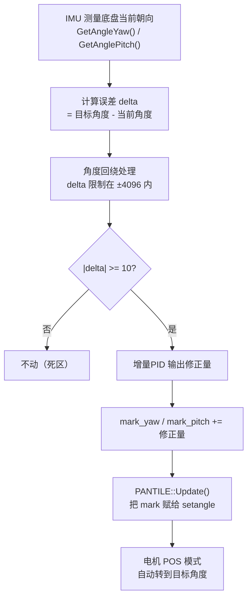
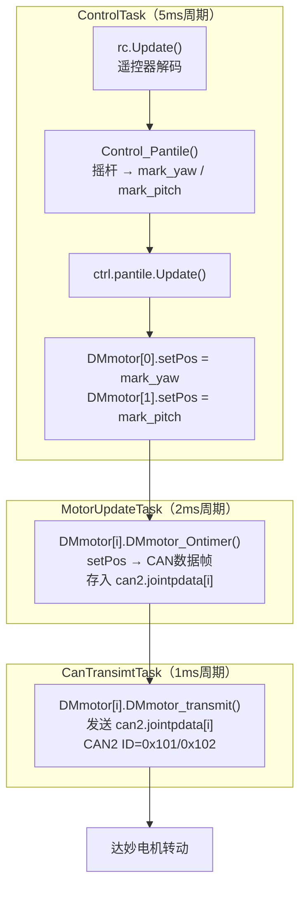

1. 云台控制 ：

达妙电机
gitee 产品资料
电机分类
can 线，终端电阻
can 分析仪
正线序和反线序
dm 调试工具功能：校准
MIT 模式：1. 关节动力学模型 ![[Pasted image 20260804103059.png]] 期望的力矩：位置误差和速度误差
发送量：刚性，阻尼，力矩补偿，期望位置，期望速度
与 pid 的区别：不是刚硬，而是柔顺
![[Pasted image 20260804103502.png]] 电机参数设置：
1. 控制幅值
2. 驱动参数
3. 通讯设置
4. 控制设置
![[Pasted image 20260804110335.png]]

![[Pasted image 20260804110400.png]]

![[Pasted image 20260804112449.png]]![[屏幕截图 2026-08-04 112401.png]]