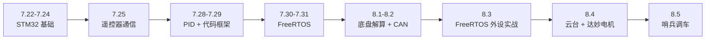
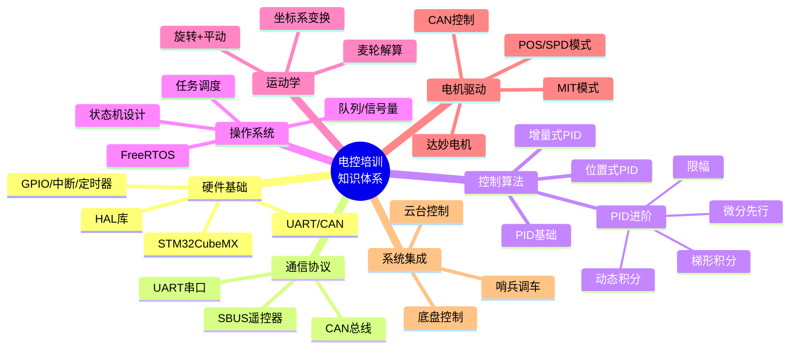

# 电控培训知识梳理（7.22 — 8.5）

> 本文档对 2026 年 7 月 22 日至 8 月 5 日期间的电控培训笔记进行系统性梳理，涵盖 STM32 基础开发、通信协议、PID 控制、FreeRTOS 实时操作系统、底盘运动学、云台控制、达妙电机驱动及哨兵机器人调车等核心知识模块。

---

## 目录

- [[#一、总体学习路线]]
- [[#二、按日期知识梳理]]
  - [[#7.22 — 工程初建与工具认识]]
  - [[#7.23 — GPIO、外部中断与定时器]]
  - [[#7.24 — C/C++ 工程规范与 UART 串口通信]]
  - [[#7.25 — 遥控器 SBUS 协议接收与解码]]
  - [[#7.28 — PID 控制算法进阶与代码框架]]
  - [[#7.29 — 队内代码框架实现与遥控器数据链路]]
  - [[#7.30 — FreeRTOS 入门]]
  - [[#7.31 — FreeRTOS 多任务系统综合设计]]
  - [[#8.1 — 底盘运动学与麦轮解算]]
  - [[#8.2 — 完整控制链路梳理与 CAN 通信详解]]
  - [[#8.3 — FreeRTOS 外设任务实战与工程配置]]
  - [[#8.4 — 云台控制与达妙电机 MIT 模式]]
  - [[#8.5 — 哨兵机器人调车]]
- [[#三、知识体系总结与分析]]
- [[#四、核心技术要点速查表]]

---

## 一、总体学习路线



整个培训遵循 **从底层硬件到上层算法、从单任务到多任务、从模块到系统** 的递进逻辑：

| 阶段 | 时间 | 核心主题 | 能力目标 |
|------|------|---------|---------|
| **基础搭建** | 7.22 — 7.24 | CubeMX 配置、GPIO、中断、定时器、UART | 能独立建工程、点灯、串口调试 |
| **通信与控制** | 7.25 — 7.29 | SBUS 遥控器、PID 算法、队内代码框架 | 能接收遥控器数据、实现 PID 闭环 |
| **操作系统** | 7.30 — 7.31 | FreeRTOS 任务/队列/信号量 | 能设计多任务并发系统 |
| **系统集成** | 8.1 — 8.4 | 麦轮解算、CAN 通信、云台、达妙电机 | 能完成完整机器人控制链路 |
| **实战调车** | 8.5 | 哨兵机器人调车 | 将理论应用于实际机器人调试 |

---

## 二、按日期知识梳理

### 7.22 — 工程初建与工具认识

#### 知识点

1. **STM32CubeMX 配置**：图形化配置芯片引脚、时钟树、外设参数，自动生成初始化代码。
2. **Keil MDK**：STM32 的传统 IDE，用于编译、下载和调试。
3. **CAN 通信概念**：
   - CAN 是一种 **串行、多主、差分信号** 的工业现场总线
   - 专为汽车电子、嵌入式控制设计，抗干扰能力极强
   - 广泛用于车载网络、机器人通信、工业 PLC
4. **FreeRTOS 系统**：初步了解实时操作系统的概念。
5. **万用表使用**：基础电路调试工具。
6. **CH010 上位机**：IMU 调试工具（`imu_cum_cn.pdf`）。

#### 分析

第一天的重点是 **建立开发环境认知**。CAN 通信是后续电机控制的核心通信方式，FreeRTOS 则是多任务调度的基础。这两项内容贯穿了整个培训周期。

---

### 7.23 — GPIO、外部中断与定时器

#### 知识点

1. **CubeMX 工程配置流程**：
   - 配置 MX → 生成代码 → 在 IDE 中编写逻辑
2. **HAL 库 GPIO 操作**：
   ```c
   HAL_GPIO_Write(GPIOA, GPIO_PIN_1, SET);  // 点亮 LED
   ```
3. **外部中断（EXTI）**：
   - 通过 CubeMX 配置引脚为 `GPIO_EXTIx` 模式
   - 在回调函数 `HAL_GPIO_EXTI_Callback()` 中处理中断
4. **定时器（TIM）**：
   - **工作流程**：先分频（PSC）→ 再计数（CNT）→ 再重装（ARR）
   - 脉冲信号（PWM）的周期由 ARR 决定，占空比由 CCR 决定
   - 分频系数决定计数频率：`f = TIM_CLK / (PSC+1)`

#### 分析

GPIO、中断和定时器是嵌入式开发的 **三大基石**。定时器产生的 PWM 信号后续直接用于电机速度控制，外部中断则是遥控器接收、按键处理的基础。

---

### 7.24 — C/C++ 工程规范与 UART 串口通信

#### 知识点

1. **工程代码规范**：
   - `.h` 文件放声明，`.cpp` 文件放实现
   - 头文件保护符 `#ifndef / #define / #endif`
   - 模块化设计，每个功能模块独立文件
2. **UART 串口通信**：
   - 异步通信协议，TX/RX 两根线
   - 波特率配置（常用 115200）
   - 用于调试打印、与上位机通信

#### 分析

良好的代码规范是团队协作的前提。UART 是最基础的通信方式，后续用于调试信息输出和串口指令控制。

---

### 7.25 — 遥控器 SBUS 协议接收与解码

#### 知识点

1. **SBUS 协议原理**：
   - 串行通信，100000 波特率，8E2 格式（8 数据位、偶校验、2 停止位）
   - 一帧 25 字节：1 字节头（0x0F）+ 22 字节通道数据 + 1 字节标志位 + 1 字节尾（0x00）
   - 接收流程：`发送 → 接收 → 写入 rxData → 空闲 → IDLE 触发 → 解码`

2. **SBUS 解码算法**：
   ```c
   void RemoteDataProcess(uint8_t m_frame[]) {
       // 前 6 字节全 0 不解码
       if ((m_frame[0] | m_frame[1] | m_frame[2] |
            m_frame[3] | m_frame[4] | m_frame[5]) == 0)
           return;

       // 解码 4 个 11 位摇杆通道（原始值 0~2048，减 1024 变为 -1024~+1024）
       rc.ch[0] = ((m_frame[0] | (m_frame[1] << 8)) & 0x07FF) - 1024;
       rc.ch[1] = (((m_frame[1] >> 3) | (m_frame[2] << 5)) & 0x07FF) - 1024;
       rc.ch[2] = (((m_frame[2] >> 6) | (m_frame[3] << 2) | (m_frame[4] << 10)) & 0x07FF) - 1024;
       rc.ch[3] = (((m_frame[4] >> 1) | (m_frame[5] << 7)) & 0x07FF) - 1024;

       // 死区处理（±8 以内归零）
       for (int i = 0; i < 4; i++)
           if (rc.ch[i] >= -8 && rc.ch[i] <= 8) rc.ch[i] = 0;

       // 两个三挡拨杆
       rc.s[0] = (m_frame[5] >> 6) & 0x03;
       rc.s[1] = (m_frame[5] >> 4) & 0x03;
   }
   ```

3. **空闲中断（IDLE）机制**：
   - UART 空闲中断在一帧数据接收完毕后触发
   - 利用字符时间判断帧尾
4. **缓冲区引用**：使用 `extern` 声明跨文件共享缓冲区
5. **通信协议**：定义了遥控器与电控板之间的数据格式

#### 分析

SBUS 解码是 **人机交互的入口**。理解位操作（11 位通道数据打包在 22 字节中）和死区处理（消除摇杆中值漂移）是关键。这段代码在后续所有项目中反复使用。

---

### 7.28 — PID 控制算法进阶与代码框架

#### 知识点

1. **PID 控制工程重建**：
   - CubeMX 配置：CAN1、TIM6、RCC、SYS、Clock
   - IDE 代码框架搭建

2. **PID 进阶技巧**：

   | 技巧 | 说明 | 解决的问题 |
   |------|------|-----------|
   | **梯形积分** | 用梯形面积代替矩形面积计算积分项 | 提高积分精度 |
   | **动态积分** | 误差大时减小积分、误差小时增大积分 | 防止积分饱和 |
   | **微分先行** | 对测量值而非误差求微分 | 避免设定值突变时微分项冲击 |
   | **限幅** | 对积分项和输出进行限幅 | 防止积分饱和和执行器过载 |

3. **代码框架设计**：队内统一的工程结构

#### 分析

PID 进阶技巧是 **从"能转"到"转得稳"** 的关键。普通 PID 在实际工程中往往不够用，需要这些改进来应对非线性、饱和、突变等实际问题。

---

### 7.29 — 队内代码框架实现与遥控器数据链路

#### 知识点

1. **队内代码框架**：
   - 实现 PID、CAN、UART 三大通信/控制模块
   - 统一的面向对象封装

2. **遥控器控制数据链路**：
   ```c
   void ControlTask(void* pvParameters) {
       while (true) {
           // rc.ch[0] = -660~660 → 映射到编码器 0~8191
           int32_t target = (rc.ch[0] + 660) * 8191 / 1320;
           can2_motor[0].setangle = target;

           ctrl.chassis.Update();
           rc.Update();
           vTaskDelay(5);
       }
   }
   ```

#### 分析

这一天实现了 **从遥控器到电机的完整数据链路**：摇杆值 → 目标映射 → CAN 发送。`vTaskDelay(5)` 表明已引入 FreeRTOS 任务概念，控制周期为 5ms。

---

### 7.30 — FreeRTOS 入门

#### 知识点

1. **FreeRTOS 核心概念**：
   - 任务（Task）、队列（Queue）、信号量（Semaphore）
   - 任务状态机：Ready → Running → Blocked → Suspended
   - 调度策略：抢占式 + 时间片轮转

2. **从裸机到 RTOS 的思维跳变**：
   - 裸机：`while(1)` 排队执行，响应慢
   - RTOS：多任务并发，高优先级可立即抢占

3. **CubeMX 配置 FreeRTOS**：
   - Tasks and Queues 界面添加任务
   - 自动生成句柄、属性定义和空函数框架

#### 分析

FreeRTOS 是整个控制系统的 **调度核心**。理解任务状态转换和优先级设计是后续所有多任务系统的基础。

---

### 7.31 — FreeRTOS 多任务系统综合设计

#### 知识点

这是内容最丰富的一天，设计了一个完整的 FreeRTOS 多任务系统：

1. **系统任务架构**：

   | 任务名 | 优先级 | 周期 | 职责 |
   |--------|--------|------|------|
   | Motor_PID_Task | 5（最高） | 10ms | PID 计算 + CAN 发送 |
   | FSM_Task | 4 | 事件驱动 | 状态机管理 |
   | CAN_Task | 3 | 中断驱动 | CAN 数据接收 |
   | USART_Task | 2 | 事件驱动 | 串口通信 |
   | LED_Water_Task | 1（最低） | 可变 | 流水灯指示 |
   | Sys_Monitor | 1 | 按需 | 系统监控 + TaskList 打印 |

2. **核心机制**：
   - **CPU 抢占**：高优先级 PID 任务可立即抢占低优先级流水灯任务
   - **任务挂起/恢复**：`vTaskSuspend()` / `vTaskResume()` 用于故障处理
   - **CAN 通信闭环**：中断接收 → 队列 → PID 计算 → CAN 发送
   - **TaskList 打印**：需开启 `configUSE_TRACE_FACILITY` 和 `configUSE_STATS_FORMATTING_FUNCTIONS`

3. **状态机设计**：
   ```
   SYSTEM_INIT → SYSTEM_RUN → SYSTEM_STOP → SYSTEM_ERROR
   ```
   - ERROR 状态下挂起电机和流水灯任务
   - 等待串口/按键恢复指令后 Resume

#### 分析

这是一个 **完整的工业级嵌入式系统架构**。优先级设计体现了"控制优先"原则：PID 最高、指示最低。状态机 + 任务挂起的组合提供了优雅的故障处理机制。

---

### 8.1 — 底盘运动学与麦轮解算

#### 知识点

1. **麦轮底盘运动学**：
   - 四轮麦克纳姆轮的全向移动能力
   - 底盘映射到一个虚拟点，点再映射到各电机
   - 右手坐标系 + 中心轴为原点

2. **运动学解算**：
   - **旋转 + 平动的线速度计算**
   - 四个电机速度公式：
     ```c
     motor[0]->setspeed = speedx - speedy + speedz;  // 右前
     motor[1]->setspeed = speedx + speedy - speedz;  // 左前
     motor[2]->setspeed = speedx + speedy + speedz;  // 左后
     motor[3]->setspeed = speedx - speedy - speedz;  // 右后
     ```

3. **四心合一概念**：四个电机的运动合成一个底盘自由度

#### 分析

麦轮解算是机器人底盘控制的 **数学基础**。理解坐标系、速度分解和逆运动学方程是实现全向移动的关键。

---

### 8.2 — 完整控制链路梳理与 CAN 通信详解

#### 知识点

1. **遥控器到电机的完整数据流（5 步）**：

   ```
   摇杆值 → 速度/角度 → 麦轮解算 → PID 计算 → CAN 发送
   ```

   | 步骤 | 输入 → 输出 | 代码位置 |
   |------|------------|---------|
   | 1 | 原始字节 → -1024~+1024 → 死区后 -660~+660 | `RC::Decode()` |
   | 2 | -660~+660 → -3000~+3000 rpm | `RC::OnRC()` |
   | 3 | vx,vy,vz → 四轮各自速度 | `CHASSIS::Update()` |
   | 4 | 速度误差 → PID → 电流值 0~16384 | `Motor::Ontimer()` |
   | 5 | 电流值 → CAN 数据帧高8位+低8位 | `Motor::Ontimer()` |

2. **CAN 通信详解**：
   - `CAN_HandleTypeDef hcan` 结构体剖析
   - `pRxMsg->StdId`：标准帧 ID（如 0x205 对应电机反馈）
   - CAN 总线拓扑、终端电阻、正/反线序

3. **达妙电机控制**：
   - CAN ID 映射（0x201 起始）
   - 驱动文件封装
   - 电机信息控制流

4. **CAN 回调函数**：
   ```c
   if (hcan == &hcan1)
       memcpy(can1.data[hcan->pRxMsg->StdId - 0x201], hcan->pRxMsg->Data, 8);
   else {
       if (hcan->pRxMsg->StdId >= 1 && hcan->pRxMsg->StdId <= 2)
           memcpy(can2.jointidata[hcan->pRxMsg->StdId - 1], hcan->pRxMsg->Data, 8);
       else
           memcpy(can2.data[hcan->pRxMsg->StdId - 0x201], hcan->pRxMsg->Data, 8);
   }
   ```

#### 分析

这一天将所有模块 **串联成完整的控制链路**。从遥杆的模拟量到电机的物理转动，每一步都有清晰的数学映射。CAN 通信的回调函数设计体现了多电机、多 CAN 总线的灵活管理。

---

### 8.3 — FreeRTOS 外设任务实战与工程配置

#### 知识点

1. **CubeMX + FreeRTOS 任务生成机制**：
   - 自动生成：任务句柄、属性定义、`osThreadNew()` 创建、空函数框架
   - 需要手动填写：任务内部业务逻辑
   - 队列同理：自动生成句柄和创建代码

2. **按键任务（状态机 + 长按恢复）**：
   - PC8：短按切换状态（STOP → RUN → FAST）
   - PC9：长按 2s 恢复被挂起的任务
   - 消抖处理：`osDelay(20)` + 二次检测
   - 使用 `osKernelGetTickCount()` 实现精确计时

3. **流水灯任务（队列驱动）**：
   - 从 `uartQueueHandle` 获取命令
   - `cmd == 1`：启动流水灯循环
   - `cmd == 0`：停止并熄灭
   - 延时 `g_flow_delay` 可被状态机动态修改

4. **UART 中断回调**：
   - 逐字节接收，检测回车/换行触发命令解析
   - `"yes"` → cmd=1，`"no"` → cmd=0
   - 通过队列传递给流水灯任务

5. **工程配置流程（VisualGDB）**：
   1. CubeMX 生成底层代码（选 STM32CubeIDE）
   2. Visual Studio → Embedded Project Wizard
   3. 选择 Import CubeMX 项目 → 指定 .ioc 文件
   4. 配置 ARM-GCC 交叉编译器
   5. 配置 ST-Link 调试器（SWD 接口）

#### 分析

这一天是 **FreeRTOS 理论到实践的落地**。按键状态机 + 队列通信 + 中断回调的组合展示了 RTOS 环境下典型的外设控制模式。工程配置流程则为后续独立开发提供了完整的工具链指导。

---

### 8.4 — 云台控制与达妙电机 MIT 模式

#### 知识点

1. **云台（Pantile）PID 控制流程**：
   ```
   IMU 测量当前朝向 → 计算角度误差 → 回绕处理 → 死区判断 → 增量 PID → 更新 mark → 电机 POS 模式
   ```
   ```c
   float delta = target - current;
   // 角度回绕处理（限制在 ±4096 内）
   if (delta <= -4096.f) delta += 8192.f;
   else if (delta >= 4096.f) delta -= 8192.f;
   // 死区 + PID
   if (abs(delta) >= 10.f)
       mark_pitch += pantile_PID[PITCH].Delta(delta);
   ```

2. **云台限位与保持**：
   - Yaw：可无限旋转，但限制在 ±4π 防止累积误差
   - Pitch：机械限位 ±45°（±0.785 rad）
   - 达妙电机用弧度制，位置范围 -4π ~ 4π

3. **遥控器设置**：
   ```c
   ch_pitch *= (-1.f);  // 方向反转
   ch_yaw *= (1.f);
   float adjangle_rad = sensitivity * 0.002f;  // 灵敏度调节
   ```

4. **达妙电机 MIT 模式**：
   - 基于关节动力学模型
   - 期望力矩 = f(位置误差, 速度误差)
   - 发送量：刚性、阻尼、力矩补偿、期望位置、期望速度
   - 适用于需要柔顺控制的场景

5. **达妙电机调试**：
   - Gitee 产品资料
   - CAN 分析仪使用
   - DM 调试工具：校准功能
   - 电机分类与 CAN 线终端电阻

6. **Motor 类封装**：
   ```c
   class Motor {
       int id; double maxRpm, targetRpm, currentRpm, output; bool enabled;
       void enable(); void disable();
       bool setTargetRpm(double rpm);
       void updateCurrentRpm(double rpm);
       double calculatePOutput(double kp);
   };
   ```

#### 分析

云台控制是 **PID 在角度域的应用**，角度回绕处理是旋转量特有的难点。达妙电机 MIT 模式代表了更高级的控制方式——从简单的速度/位置控制升级到力矩+阻抗控制，为复杂交互场景（如碰撞检测、柔顺操作）提供了可能。

---

### 8.5 — 哨兵机器人调车

#### 知识点

1. **哨兵机器人特点**：
   - 自主巡逻 + 视觉识别 + 自动射击
   - 轨道运动（一维线性运动）
   - 需要精确的位置控制和速度控制

2. **调车要点**：
   - 底盘在轨道上的运动控制
   - 云台快速瞄准 + 稳定跟踪
   - 遥控器模式切换（手动/自动）
   - 各子系统联调与参数整定

3. **实战经验**：
   - PID 参数需要根据实际负载调整
   - 通信延迟对控制性能的影响
   - 故障诊断与应急处理

#### 分析

调车是将所有理论知识 **落地到实际机器人** 的关键环节。理论模型和实际系统之间总存在差距（摩擦力、间隙、延迟等），需要通过反复调试来弥补。

---

## 三、知识体系总结与分析

### 3.1 核心技术栈



### 3.2 学习曲线分析

| 阶段 | 难度 | 关键突破点 |
|------|------|-----------|
| 基础搭建（7.22-7.24） | ★★☆☆☆ | CubeMX 使用、HAL 库 API 熟悉 |
| 通信协议（7.25） | ★★★☆☆ | SBUS 位操作解码、IDLE 中断机制 |
| 控制算法（7.28-7.29） | ★★★★☆ | PID 进阶技巧、完整数据链路 |
| 操作系统（7.30-7.31） | ★★★★★ | 多任务思维、优先级设计、状态机 |
| 运动学（8.1-8.2） | ★★★★☆ | 麦轮逆运动学、坐标系变换 |
| 系统集成（8.3-8.5） | ★★★★★ | 多模块联调、实际参数整定 |

### 3.3 关键设计模式总结

1. **中断 + 队列 + 任务** 三层架构：
   - 中断负责快速数据采集
   - 队列实现跨任务数据传递
   - 任务负责业务逻辑处理

2. **面向对象封装**：
   - Motor 类封装电机状态和控制
   - CHASSIS 类封装底盘运动学
   - PANTILE 类封装云台控制
   - RC 类封装遥控器解码

3. **状态机驱动**：
   - FSM 管理全局系统状态
   - 不同状态对应不同的任务组合和行为

4. **分层优先级设计**：
   - 安全相关 > 控制相关 > 通信相关 > 显示相关

### 3.4 常见坑与注意事项

| 问题 | 原因 | 解决方案 |
|------|------|---------|
| ST-Link 死锁 | SYS 未配置 Serial Wire | CubeMX 中 SYS → Debug 选 SW |
| 遥控器数据乱码 | 波特率或格式不对 | SBUS 需 100000 波特率、8E2 |
| 电机不转 | CAN ID 不匹配 | 检查 StdId 和回调函数映射 |
| PID 振荡 | 参数过大或无滤波 | 先调 P，再加 D，最后加 I |
| 角度跳变 | 未做回绕处理 | ±4096 / ±4π 边界处理 |
| 任务卡死 | 优先级设计不合理 | 高优先级任务不能有长延时 |
| 积分饱和 | 无动态积分/限幅 | 加入梯形积分和输出限幅 |

---

## 四、核心技术要点速查表

### 通信协议

| 协议 | 波特率 | 用途 | 关键配置 |
|------|--------|------|---------|
| SBUS | 100000, 8E2 | 遥控器接收 | UART + IDLE 中断 + DMA |
| CAN | 1Mbps（典型） | 电机控制 | 终端电阻 120Ω、ID 映射 |
| UART | 115200 | 调试打印 | TX/RX + 中断接收 |

### PID 参数整定口诀

> **先 P 后 D 再 I**：先调比例到临界振荡，加微分抑制振荡，最后加积分消除静差。

### FreeRTOS 常用 API

| API | 功能 | 使用场景 |
|-----|------|---------|
| `osThreadNew()` | 创建任务 | 系统初始化 |
| `osDelay()` | 任务延时 | 周期任务 |
| `osMessageQueuePut/Get()` | 队列收发 | 跨任务通信 |
| `osThreadSuspend/Resume()` | 挂起/恢复任务 | 故障处理 |
| `vTaskList()` | 打印任务状态 | 调试监控 |
| `osKernelGetTickCount()` | 获取系统时间 | 精确计时 |

### 达妙电机 CAN ID 对照

| 电机 | CAN ID | 说明 |
|------|--------|------|
| 电机 1 | 0x201 | CAN2 组 |
| 电机 2 | 0x202 | CAN2 组 |
| 电机 3 | 0x203 | CAN2 组 |
| 电机 4 | 0x204 | CAN2 组 |
| 关节电机 | 0x01~0x02 | CAN2 joint 组 |

---

> **总结**：从 7.22 到 8.5 的两周培训，完成了从 **STM32 基础开发** 到 **完整机器人控制系统** 的知识跨越。核心能力包括：嵌入式工程搭建、多通信协议处理、PID 控制算法、FreeRTOS 多任务系统设计、底盘运动学解算、云台控制和电机驱动。这些知识构成了 RoboMaster 电控开发的完整基础体系。
