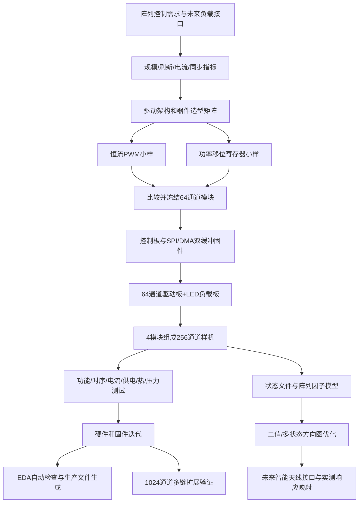

# “基于单片机的大规模阵列控制电路设计与实现”大创申请书撰写思路与详细大纲

> 项目组：队长杨（电子信息工程）、队员林（通信工程）、队员王（计算机科学）  
> 核心定位：硬件控制电路是主体，LED 阵列是可视化验收载体，智能天线阵列是拓展应用。  
> 撰写原则：以工程问题、量化指标、分阶段样机和可复现实验为主线，避免把普通 LED 显示包装成“大规模阵列创新”，也避免过度承诺 AI 和真实天线成果。

---

## 1. 申请书需要讲清楚的核心逻辑

整份申请书应围绕一条主线展开：

> 智能可调天线、阵列传感和大规模执行单元需要对数百至上千个单元进行准确、同步、稳定和可扩展的状态控制；普通单片机 GPIO 无法直接满足规模要求，传统 LED 显示方案又不能完整验证独立输出、电流驱动和未来负载接口。项目因此设计“单片机控制板—可级联驱动板—可更换负载板”的模块化平台，采用硬件定时、SPI/DMA、统一锁存和自动测试，实现 256 路基础样机并验证向 1024 路扩展的可行性，以 LED 阵列完成可视化验收，同时开发 EDA 自动化与阵列因子仿真工具，为实验室后续智能天线阵列提供控制基础。

这条逻辑包含五个递进层次：

1. 有真实的大规模控制需求；
2. 现有简单方法存在规模、同步、电流和迁移性不足；
3. 本项目提出模块化硬件和软硬件协同方案；
4. 用可测量指标和 LED 负载完成闭环验证；
5. 将接口和仿真拓展到智能天线，但不把尚未完成的天线作为结题前提。

---

## 2. 推荐项目名称

### 首选

**基于单片机的可扩展大规模阵列控制电路设计与实现**

加入“可扩展”，能更准确体现模块化级联和从 256 路向 1024 路拓展的特点。

### 备选

1. 面向智能可调阵列的单片机多通道控制电路设计与实现
2. 基于单片机的模块化多通道阵列控制平台设计
3. 面向大规模阵列单元的同步控制与驱动电路设计
4. 基于单片机与脚本化 EDA 的可扩展阵列控制系统

不建议标题直接写“智能天线阵列控制系统”，因为真实天线不是硬性验收对象；也不建议标题加入“AI”，因为 AI 只是辅助设计和算法拓展，不是项目主体。

---

## 3. 项目类型与学科定位

建议定位为：

- 工程实践与应用创新型项目；
- 电子信息工程为主体；
- 通信工程提供阵列应用、天线接口和测试场景；
- 计算机科学提供上位机、自动测试、EDA 自动化和优化算法。

项目不是纯理论研究，也不是简单作品制作。研究性主要体现为：

- 多种扩展驱动架构的比较与选型；
- 大规模级联时序、供电和电流一致性问题；
- 模块化接口和可扩展方法；
- 自动化设计—制造—测试闭环；
- 硬件状态与阵列方向图模型之间的映射。

---

## 4. 摘要写法

### 4.1 摘要结构

按四层组织：

1. **需求和问题**：为什么需要大规模阵列控制，现有简单方案有什么不足；
2. **拟采用的方法**：模块化硬件、SPI/DMA、锁存、负载驱动和上位机；
3. **研究与验证内容**：256 路基础样机、1024 路扩展、时序/电流/热/可靠性；
4. **拓展和意义**：EDA 自动化、阵列因子仿真、未来天线接口。

### 4.2 摘要示例

面向智能可调天线、阵列照明与大规模执行单元的多通道状态控制需求，本项目拟设计一种基于单片机的可扩展阵列控制平台。系统采用“控制板—级联驱动板—可更换负载板”的模块化架构，利用 SPI/DMA、双缓冲与统一锁存实现多通道独立寻址、同步刷新和模式控制，并以 16×16 LED 阵列作为可视化负载，测量验证通道正确性、刷新率、电流一致性、供电稳定性及热性能。在此基础上，开发 Python 上位机、随机压力测试和 EDA 自动化脚本，实现设计检查、生产文件生成与软硬件映射一致性管理；拓展建立平面阵列因子模型，研究二值或多状态阵列的方向图计算与优化。项目预期形成 256 路完整样机、面向 1024 路的扩展架构及配套软硬件成果，为实验室后续智能可调天线阵列的控制接口和算法验证奠定基础。

### 4.3 摘要中避免的表达

- “实现世界领先的大规模阵列控制”；
- “通过 AI 自动完成 PCB 设计”；
- “LED 阵列直接模拟真实天线电磁辐射”；
- “仅通过导通状态实现任意波束扫描”；
- “具有高实时性、高精度和高可靠性”，但不给指标；
- “首次将单片机用于 LED 阵列”。

---

# 5. 申请书详细大纲

## 一、项目背景与研究意义

### 1.1 应用背景

可从以下场景切入，但不要铺陈过多：

- 智能可调天线和可重构阵列；
- 大规模 LED/光电阵列；
- 阵列传感、执行器和实验教学平台；
- 多单元开关、偏置和状态配置。

建议表述：

> 随着阵列规模增大，系统控制对象由少量独立器件扩展到数百乃至上千个单元。控制系统不仅需要完成状态写入，还需保证通道映射准确、更新同步、输出电流稳定、供电安全和模块扩展方便。

### 1.2 具体问题

围绕五个矛盾展开：

1. GPIO 数量与通道规模；
2. 串行传输效率与同步更新；
3. 大量通道同时切换与供电/噪声；
4. LED 快速验证与未来天线接口迁移；
5. 重复电路规模与人工 EDA 易错。

### 1.3 项目意义

**工程意义**

- 建立通用多通道控制基础；
- 形成可测量、可复制的模块化电路；
- 为后续天线偏置/开关控制降低开发风险。

**人才培养意义**

- 贯通单片机、电路、PCB、嵌入式软件、测试、通信阵列和算法；
- 三个专业形成真实接口协作；
- 学生经历完整工程闭环。

**方法意义**

- 以单一配置源统一硬件编号、固件映射、上位机和仿真；
- 将 EDA 自动化、软件测试和硬件测试纳入电路项目。

---

## 二、相关技术与现有基础

### 2.1 按工程方案组织现状

1. MCU GPIO 直接驱动；
2. 移位寄存器 + 外部驱动；
3. 功率移位寄存器；
4. 恒流 PWM 驱动；
5. 专用 LED 矩阵驱动；
6. FPGA/分布式控制；
7. 脚本化 EDA 和硬件持续集成；
8. 阵列因子与离散状态优化。

### 2.2 现有方案不足

- GPIO 直接驱动规模小；
- 行列扫描适合显示，但不能完整代表独立持续输出；
- 普通移位寄存器需额外功率级；
- 长链存在时序和信号完整性风险；
- 恒流驱动电流一致性好，但极性、散热和接口要匹配；
- FPGA 性能高，但单片机更符合本项目成本、培养目标和刷新需求；
- EDA 自动化适合重复结构和生产文件，不应取代人工电气审核。

### 2.3 项目已有条件

结合实验室真实资源写：

- 单片机开发和 PCB 制作条件；
- 焊接、示波器、逻辑分析仪、稳压电源和万用表；
- 实验室正在研发的智能可调天线阵列；
- 三名学生的专业互补；
- 指导教师在通信、阵列或嵌入式方向的积累。

未实际具备的设备不要写。需借用的热像仪、电子负载等写成“可协调使用”。

---

## 三、项目总体目标

### 3.1 总体目标

> 设计并实现一套基于单片机的模块化大规模阵列控制平台，以 256 路独立通道为基础验收规模，完成从上位机命令、单片机协议解析、硬件定时刷新、级联驱动到 LED 负载输出的完整链路，验证通道映射、同步更新、电流一致性、供电稳定性和长期运行可靠性；进一步研究 1024 路扩展、EDA 自动化及阵列方向图仿真，为智能可调天线阵列接口预留条件。

### 3.2 分目标

1. 建立需求和选型模型，确定驱动架构；
2. 设计单片机控制板和 32/64 通道驱动模块；
3. 实现 SPI/DMA、双缓冲和统一锁存；
4. 搭建 16×16 LED 阵列完整样机；
5. 开发 Python 上位机和自动测试系统；
6. 完成时序、电气、热和可靠性测试；
7. 实现 KiCad 设计检查与生产文件自动化；
8. 实现阵列因子和离散状态优化拓展；
9. 输出未来天线接口需求和适配方案。

### 3.3 量化指标

| 类别 | 指标 |
|---|---|
| 规模 | 基础样机不少于 256 路独立输出；架构预留至 1024 路 |
| 寻址 | 支持整帧、单通道、区域和预设模式 |
| 刷新 | 完整帧不低于 100 帧/s；挑战目标 1 bit 模式 1000 帧/s |
| 同步 | 统一锁存，无明显中间态；代表性输出更新偏差可测 |
| 正确性 | \(10^5\) 帧随机测试无观测到逻辑错误 |
| 安全 | 上电、复位和异常时输出默认关闭 |
| 电气 | 通道电流变异系数不高于 5%；满载关键供电偏移不高于 5% |
| 热 | 规定工况连续运行 30 min，无过热失效并形成温升记录 |
| 软件 | 上位机、压力测试、日志和可视化可复现 |
| EDA | 自动运行 ERC/DRC 并生成 BOM、Gerber、钻孔和制板包 |
| 仿真 | 支持 8×8/16×16 状态导入、方向图和主要指标计算 |

---

## 四、研究内容

### 4.1 内容一：需求建模与架构选型

**内容**

- 通道规模、状态位数、刷新率和接口；
- LED 与未来天线负载的电压、电流和极性；
- 普通移位寄存器、功率移位寄存器、恒流 PWM 驱动比较；
- 单长链、多链和模块化结构；
- 数据率、电流、热和 PCB 预算。

**成果**

- 需求规格书；
- 器件选型矩阵；
- 总体架构和接口规范；
- 初步计算报告。

### 4.2 内容二：模块化多通道控制与驱动电路

**内容**

- MCU 最小系统和通信接口；
- SPI、锁存、消隐、使能和故障接口；
- 32/64 通道驱动模块；
- LED 负载板；
- 分区供电、保护、去耦和测试点；
- 板间级联与可更换输出接口；
- PCB 设计、制板和装配。

**成果**

- 控制板、驱动模块和 LED 阵列板；
- 原理图、PCB、BOM、Gerber；
- 板级测试记录。

### 4.3 内容三：实时控制固件与上位机

**内容**

- PC—MCU 帧协议；
- 通道逻辑—物理映射；
- SPI/DMA 与双缓冲；
- 定时刷新和统一锁存；
- 模式存储与播放；
- CRC、序列号、看门狗和异常安全；
- Python CLI/GUI、日志和数据导出。

**成果**

- 固件、上位机、协议文档、使用说明和自动测试。

### 4.4 内容四：系统测试与迭代

**内容**

- 单点、行列、棋盘格、随机和快速切换；
- SPI 时序和链路错误率；
- 输出电流一致性；
- 供电跌落和温升；
- 长时间压力测试；
- 多链与单链对比；
- PCB/固件参数迭代。

**成果**

- 测试方案、波形、数据、照片、日志和最终测试报告。

### 4.5 内容五：EDA 自动化与阵列应用拓展

**内容**

- kicad-cli/KiBot 自动检查和生产文件；
- Python 生成编号、映射、测试图案和文档；
- 可选 SKiDL/脚本化重复电路；
- 视觉识别 LED 图案；
- 阵列因子计算；
- 二值/多状态优化；
- 天线偏置/开关接口需求。

**成果**

- 自动化脚本、CI、单一配置文件、仿真工具、优化实验和天线接口说明。

---

## 五、拟解决的关键问题

### 5.1 有限 MCU 接口下的规模扩展与同步刷新

- 如何从有限引脚扩展到数百/上千路；
- 如何避免串行写入中间态；
- 如何在多个模块间保持确定更新时刻；
- 如何平衡链长、时钟、帧率和可靠性。

### 5.2 多通道切换下的驱动一致性与电源完整性

- 电流设定和通道差异；
- 驱动器功耗和散热；
- 电源压降、瞬态电流和地弹；
- 逻辑与负载电源耦合；
- 可测量的设计裕量。

### 5.3 硬件阵列、软件映射和天线状态模型的一致性

- 逻辑坐标、物理通道、PCB 丝印和仿真单元一一对应；
- 同一配置源生成映射和测试；
- LED 状态不等同于真实电磁响应；
- 未来以幅相响应表接续真实天线模型。

---

## 六、技术路线

### 6.1 文字路线

1. 需求分解和器件调研；
2. 数据率、电流、功耗和时序预算；
3. 两类驱动小样比较；
4. 冻结控制板、驱动板和负载板接口；
5. 开发 SPI/DMA/锁存固件和上位机协议；
6. 制作 64 通道模块；
7. 集成 256 通道 LED 阵列；
8. 建立随机、时序、电流和热测试；
9. 根据测量修改电路和固件；
10. 建立 EDA 自动构建和阵列仿真；
11. 验证 1024 通道扩展；
12. 总结成果和未来天线接口。

### 6.2 技术路线图

正式绘图时：主线与拓展线用不同浅色；真实天线放在虚线拓展框；测试反馈箭头回指硬件和固件。

---

## 七、研究方法

### 7.1 指标驱动的系统工程方法

- 将需求转为量化指标；
- 先做预算和最坏条件分析；
- 用决策矩阵选器件；
- 用接口规范约束三人的工作。

### 7.2 分层原型和渐进扩展

- 16 路验证器件；
- 64 路验证模块；
- 256 路完整验收；
- 1024 路挑战扩展。

### 7.3 仿真—实物—测量闭环

- 理论计算数据率、电流和功耗；
- 原理图/PCB 自动检查；
- 样机测量时序、电流、温度和错误率；
- 用测量结果修订参数和布局。

### 7.4 对比实验

1. 恒流驱动与电阻限流的一致性；
2. 单长链与多短链的稳定时钟；
3. 轮询刷新与 DMA 双缓冲的性能；
4. 随机搜索、遗传算法与小阵列穷举。

### 7.5 自动化与可复现

- Git 版本控制；
- 统一 `array_config.yaml`；
- 自动生成映射、PCB 编号、测试和仿真坐标；
- 自动 ERC/DRC 和生产文件；
- 固定随机种子；
- 保存原始波形和日志。
---

## 八、项目创新点

创新点不应夸大为基础器件创新，应突出系统方法和跨层协同。

### 创新点一：面向负载迁移的三级模块化阵列控制架构

将 MCU 控制、级联驱动与 LED/天线负载接口分离，使 LED 可完成可视化验收，同时为不同电流、电压和极性的未来阵列单元保留可替换输出级。

### 创新点二：基于硬件定时与统一锁存的大规模同步刷新

采用 SPI/DMA、双缓冲、统一锁存和可选消隐，将“数据传输过程”和“物理阵列状态切换”分离，避免逐路更新产生中间态，并通过测量评估同步和时序裕量。

### 创新点三：电路设计、软件映射与自动测试的一体化配置

以统一阵列配置生成通道映射、固件参数、PCB 标识、测试图案和仿真坐标，降低数百通道人工编号和复制带来的错误。

### 创新点四：控制状态到阵列响应模型的可扩展接口

在不强制完成真实天线的前提下，将硬件状态文件直接输入阵列因子模型；未来可用全波仿真或实测复响应替换理想模型，形成控制电路与天线算法之间的接口。

### 创新点五：脚本化 EDA 与硬件持续集成

将 ERC/DRC、BOM、Gerber、钻孔和文档生成纳入自动流程，使项目不仅交付样机，也交付可重复制造和可追溯的工程过程。

---

## 九、可行性分析

### 9.1 技术可行性

- SPI、DMA、锁存和多通道驱动均有成熟器件与官方资料；
- 256 路二值帧数据量很小，主流 STM32 可以处理；
- 模块化将复杂度拆分为可逐级验证的小任务；
- LED 负载便于观察和自动视觉核验；
- 阵列因子可从理想模型起步，不依赖真实天线进度。

### 9.2 团队可行性

**杨同学**

- 专业与单片机、电子电路、PCB 最匹配；
- 担任队长、硬件主责和系统集成负责人。

**林同学**

- 负责制作和测量；
- 通信背景用于衔接阵列、信道和天线接口。

**王同学**

- 负责 Python、自动测试、EDA 脚本和优化算法；
- 软件工作直接服务硬件正确性和可复现性。

### 9.3 工作包

| 工作包 | 内容 | 主责 | 配合 |
|---|---|---|---|
| WP1 | 需求、选型、接口和预算 | 杨 | 林、王 |
| WP2 | 控制板和 64 路驱动模块 | 杨 | 林 |
| WP3 | 固件、协议和上位机 | 杨、王 | 林 |
| WP4 | LED 装配与电气/热/时序测试 | 林 | 杨、王 |
| WP5 | EDA 自动化和视觉测试 | 王 | 杨 |
| WP6 | 阵列仿真和优化 | 王、林 | 杨 |
| WP7 | 256 路集成、1024 路拓展与结题 | 杨 | 全体 |

---

## 十、进度安排

以下按 12 个月示例，可按学校周期调整。

| 月份 | 主要任务 | 阶段成果 |
|---|---|---|
| 第1月 | 需求分解、资料学习、未来负载接口调研 | 需求规格书、学习记录 |
| 第2月 | 数据率/电流/热预算，驱动器选型 | 选型矩阵、总体架构 |
| 第3月 | 16 通道两类驱动小样、基础固件 | 小样和时序波形 |
| 第4月 | 冻结 64 通道模块、协议和映射 | 接口规范、原理图 |
| 第5月 | 第一版 PCB、上位机 CLI、EDA 自动检查 | PCB 制板包、软件初版 |
| 第6月 | 焊接、分块上电、64 通道联调 | 64 路模块和测试报告 |
| 第7月 | 修改 PCB/固件，制作 LED 阵列 | 修正版硬件、负载板 |
| 第8月 | 256 通道集成、功能和随机测试 | 256 路完整样机 |
| 第9月 | 时序、电流、供电、温升和压力测试 | 原始数据和指标表 |
| 第10月 | KiBot/CI、视觉核验、文档自动化 | 自动化工具链 |
| 第11月 | 1024 路扩展、阵列仿真与优化 | 扩展实验和仿真结果 |
| 第12月 | 成果整理、报告、演示和答辩 | 结题材料、视频和仓库 |

### 关键里程碑

- **M1（第3月）**：16 通道原理闭环；
- **M2（第6月）**：64 通道模块稳定；
- **M3（第8月）**：256 通道完整样机；
- **M4（第10月）**：自动测试和 EDA 自动化；
- **M5（第12月）**：拓展验证与结题。

---

## 十一、三名成员的正式分工写法

### 11.1 队长杨

- 统筹项目计划、技术接口和阶段验收；
- 负责 MCU、驱动器件、电源和保护方案；
- 负责原理图、PCB、制板和核心固件；
- 组织硬件上电、故障定位和整机集成；
- 牵头中期和结题技术材料。

### 11.2 队员林

- 配合器件焊接、模块装配和 LED 阵列制作；
- 负责时序、电流、供电、热和压力测试；
- 整理实验数据、波形和测试报告；
- 调研未来天线单元的偏置、开关和接口需求；
- 参与阵列几何、通信指标和实验结果分析。

### 11.3 队员王

- 负责 Python 上位机、协议工具、日志和可视化；
- 负责随机图案、压力测试和视觉核验；
- 负责 KiCad 命令行、KiBot 和 CI 自动化；
- 负责阵列因子、方向图指标和优化算法；
- 将统一配置文件同步到软件、测试和仿真。

### 11.4 防止分工割裂的机制

- 每项关键接口形成文档；
- 每周固定一次软硬件联调；
- 代码、PCB 和测试数据统一进 Git 仓库；
- 每个里程碑由至少两人共同复现；
- 队长负责整体推进，但不包揽全部工作。

---

## 十二、预期成果

### 12.1 实物成果

- 单片机控制板 1 套；
- 32/64 通道可级联驱动板若干；
- 16×16 LED 阵列样机；
- 电源、线束、转接和测试夹具；
- 可选未来天线接口转接板。

### 12.2 软件成果

- MCU 固件；
- Python CLI/GUI；
- 自动压力测试；
- 视觉核验；
- EDA 自动构建；
- 阵列因子和优化程序；
- 完整 Git 仓库和版本标签。

### 12.3 文档成果

- 需求规格书；
- 架构和接口文档；
- 原理图、PCB、BOM 和生产文件；
- 测试方案、原始数据和测试报告；
- 天线接口需求说明；
- 项目研究报告；
- 演示视频。

可争取竞赛、软件著作权、实用新型或论文，但不宜全部列为硬性指标。

### 12.4 指标与证据对应关系

| 指标 | 证据 |
|---|---|
| 256 路独立控制 | 逐点/随机图案视频和自动识别结果 |
| 刷新率 | 逻辑分析仪时间戳 |
| 同步 | 多通道示波器波形 |
| 电流一致性 | 抽样数据、均值和变异系数 |
| 供电稳定性 | 满载电压波形 |
| 热性能 | 热像图或温度曲线 |
| 压力测试 | 帧数、随机种子和错误日志 |
| 自动化 | CI 日志和自动生成制板包 |
| 阵列仿真 | 代码、参数、方向图和基线对比 |

---

## 十三、风险与应对

### 13.1 规模风险

- 基础目标锁定 256 路；
- 1024 路作为挑战目标；
- 若经费或焊接量不足，可用多模块电气链路和部分负载验证 1024 路。

### 13.2 PCB 风险

- 先做 16 路样机；
- 64 路板稳定后再复制；
- 控制板、驱动板和 LED 板分开；
- 预留测试点、零欧姆电阻和阻尼位；
- 预算允许两轮 PCB。

### 13.3 供电和热风险

- 低电流调试；
- 分区供电和保险；
- 设置最大同时导通比例；
- 用热测量决定是否降低电流或占空比。

### 13.4 时序风险

- 多短链替代单长链；
- 降低 SPI 时钟；
- 缓冲时钟/锁存；
- 调整源端阻尼；
- 以波形和错误率为依据调试。

### 13.5 软件和自动化风险

- 固定 KiCad 和依赖版本；
- 自动化脚本保留手工后备流程；
- AI 生成代码必须评审、测试和版本管理；
- 不将全自动布线列为硬性任务。

### 13.6 天线拓展风险

- LED 作为硬性验收；
- 天线只要求接口分析、仿真或少量联调；
- 真实波束形成依赖相位或复响应，不做不准确承诺。

---

## 十四、经费预算写法

没有本地报价前不要写死金额，可按学校额度分配比例：

| 类别 | 建议比例 | 主要内容 |
|---|---:|---|
| MCU、驱动芯片和无源器件 | 20% | 开发板、驱动器、缓冲、保护和备件 |
| PCB 制作与装配 | 25% | 控制板、驱动板、LED 板、二次打样 |
| LED、连接器和结构件 | 15% | LED、排针、线束、底板和支架 |
| 电源与保护 | 15% | 稳压模块、电源、保险、端子 |
| 测试耗材和夹具 | 10% | 探针、测试线、温度传感、转接板 |
| 资料、打印与展示 | 5% | 文档、展板和演示材料 |
| 风险储备 | 10% | 器件损耗、补板和替代方案 |

预算说明应强调：

- 模块化允许少量先行打样；
- 驱动芯片需要备件；
- PCB 可能需要两轮迭代；
- 不重复购置实验室已有仪器；
- 经费用于可测量样机，而非装饰性显示效果。

---

## 十五、参考文献组织建议

建议 15～25 条，分为：

1. MCU/SPI/DMA 官方手册；
2. 驱动芯片数据手册和应用报告；
3. 电源、信号完整性和 PCB 参考；
4. 天线阵列和优化方法；
5. KiCad/KiBot/SKiDL 等软件文档。

优先使用：

- ST、TI、Analog Devices、Nexperia 官方资料；
- KiCad、KiBot、SciPy、DEAP、pymoo 官方文档；
- Balanis 等教材；
- 阵列稀疏化和优化的同行评审论文。

博客和论坛可放学习资料，不宜作为关键电气指标的唯一依据。

---

## 十六、建议准备的图表

1. **图1：项目应用场景与边界**
   - 大规模阵列需求；
   - LED 为替代验证；
   - 天线为拓展应用。

2. **图2：总体硬件架构**
   - PC、MCU、驱动模块、LED/天线转接。

3. **图3：技术路线图**
   - 需求—小样—模块—系统—测试—拓展。

4. **图4：64 通道模块与 256/1024 扩展示意**
   - 多链结构和统一锁存。

5. **图5：软件与 EDA 自动化流程**
   - 配置文件生成固件映射、PCB 编号、测试和仿真。

6. **图6：阵列状态到方向图的模型**
   - 二值状态—幅相系数—阵列因子—指标—优化。

7. **表1：驱动方案比较**
8. **表2：量化指标**
9. **表3：三人分工**
10. **表4：进度和里程碑**
11. **表5：风险矩阵**

---

## 十七、常见写作问题与修正

### 问题1：把“大规模”只写成形容词

错误：

> 实现大规模 LED 阵列控制。

修正：

> 完成不少于 256 路独立输出的完整样机，并验证采用 4 条并行级联链扩展到 1024 路的时序与接口可行性。

### 问题2：把 LED 显示与天线控制直接等同

错误：

> LED 亮灭即可模拟天线波束形成。

修正：

> LED 亮灭用于验证控制状态的寻址、同步和驱动；在算法层将同一状态矩阵解释为理想阵列幅度权重，真实天线方向图仍需结合单元幅相响应和互耦进行修正。

### 问题3：泛化“实时”

错误：

> 系统能够实时刷新。

修正：

> 基础样机完整帧刷新率不低于 100 帧/s，并测量 DMA 刷新周期、锁存时刻和代表性通道更新偏差。

### 问题4：过度承诺 AI

错误：

> AI 自动完成电路和 PCB 设计并获得最优波束。

修正：

> 使用 Python 和 EDA 命令行工具辅助生成重复结构、运行规则检查和输出生产文件；在阵列模型中采用遗传算法等方法搜索离散状态，并与穷举或随机基线比较。

### 问题5：创新点只是器件组合

错误：

> 创新地采用单片机和移位寄存器控制 LED。

修正：

> 创新集中在可替换负载的模块化架构、统一锁存的同步刷新、单一配置源驱动软硬件映射以及设计—制造—测试自动闭环。

### 问题6：三人分工互不相干

错误：

- 杨做硬件；
- 林做天线；
- 王做 AI。

修正：

- 杨负责硬件主线和集成；
- 林负责硬件装配、测量和天线接口；
- 王的软件、EDA 和算法接收同一通道映射并服务硬件测试；
- 每月安排共同里程碑和接口验收。

---

## 十八、答辩时的核心说法

### 18.1 30 秒项目说明

> 我们不是做一块普通 LED 屏，而是设计一套可扩展的阵列单元控制平台。系统把单片机控制、级联驱动和负载接口分开，以 256 个独立 LED 通道验证寻址、同步刷新、电流、供电和可靠性，并预留扩展至 1024 路的多链结构。软件侧同时完成上位机、自动测试和 EDA 构建，拓展侧将同一状态矩阵接入阵列因子模型，为实验室后续智能可调天线提供控制和算法接口。

### 18.2 专家问“创新在哪里”

> 单个驱动芯片和 SPI 都是成熟技术，项目创新不在重新发明器件，而在把大规模控制中的模块扩展、同步锁存、电流与供电完整性、软硬件映射、自动化测试和未来天线状态模型统一到一套可制造、可测量、可迁移的平台中。

### 18.3 专家问“为什么不用 FPGA”

> FPGA 适合更高并行度，但本项目首先研究在低成本单片机条件下，如何通过多链 SPI、DMA 和硬件锁存实现数百到上千路控制。该方案更符合本科生培养、成本和现阶段刷新需求；若未来通道数和确定性要求进一步提高，模块接口可迁移至 FPGA 控制器。

### 18.4 专家问“真实天线没有完成怎么验收”

> 项目硬性验收对象是控制电路和 LED 可视化负载，包括通道正确性、刷新率、电流一致性、供电和热性能。天线部分只承担接口定义和算法拓展，不依赖天线研发进度，因此不会影响项目闭环。

---

## 十九、提交前自检清单

### 项目边界

- [ ] 明确 LED 是替代负载，不是项目目的本身；
- [ ] 明确天线不是硬性验收；
- [ ] 明确基础 256 路、挑战 1024 路；
- [ ] 没有承诺 AI 全自动设计。

### 技术内容

- [ ] 有总体架构和驱动方案比较；
- [ ] 有 SPI/DMA、双缓冲和统一锁存；
- [ ] 有供电、热、时序和安全设计；
- [ ] 有通道映射和自动测试；
- [ ] 区分开关稀疏化与相位波束扫描。

### 指标

- [ ] “大规模”有通道数；
- [ ] “实时”有帧率；
- [ ] “同步”有测量方法；
- [ ] “稳定”有压力测试；
- [ ] “一致性”有统计指标；
- [ ] “可扩展”有模块和链路结构。

### 团队

- [ ] 杨的硬件主线明确；
- [ ] 林不只是焊接，还有测试和天线接口；
- [ ] 王的软件任务直接服务硬件和仿真；
- [ ] 每项关键成果至少两人可复现。

### 成果和风险

- [ ] 实物、代码、文档和原始测试数据齐全；
- [ ] PCB 允许两轮迭代；
- [ ] 器件替代和降级路线明确；
- [ ] 1024 路、EDA 自动化和 AI 优化均有降级方案；
- [ ] 结题证据与每个指标一一对应。

---

## 二十、建议下一步撰写顺序

1. 指导教师与三名学生共同冻结“需求规格与量化指标”；
2. 杨、林完成驱动器件和未来负载接口调研；
3. 王完成软件、EDA 和仿真工具范围界定；
4. 先写“研究内容—关键问题—技术路线”，把技术闭环打通；
5. 再写目标、创新、可行性、进度和分工；
6. 最后写背景、现状和摘要；
7. 用指标表逐条检查全文，避免规模、帧率和成果不一致；
8. 提交前按“基础目标必须完成、拓展目标可降级”再审一次。

---

## 二十一、申请书的最终落点

申请书应让评审形成以下判断：

- 题目具有明确的大规模阵列控制需求；
- 技术路线不是简单堆叠模块，而是从指标、架构、硬件、固件到测试完整闭环；
- 256 路目标对三名本科生有挑战但可完成；
- 1024 路、EDA 自动化和阵列算法提供足够拓展空间；
- 三个专业的分工互补且接口清晰；
- 即使智能天线阵列尚未完成，项目仍能独立验收并形成可复用成果；
- 成果能够继续服务实验室后续天线和通信研究。
