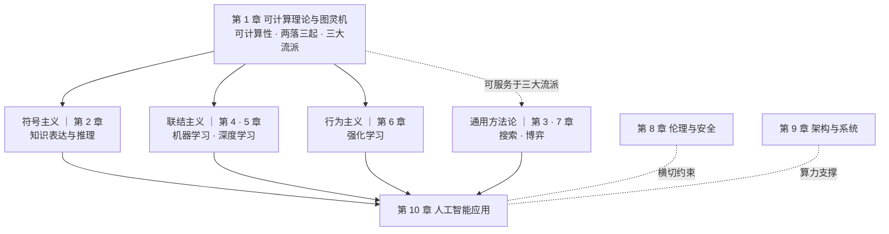
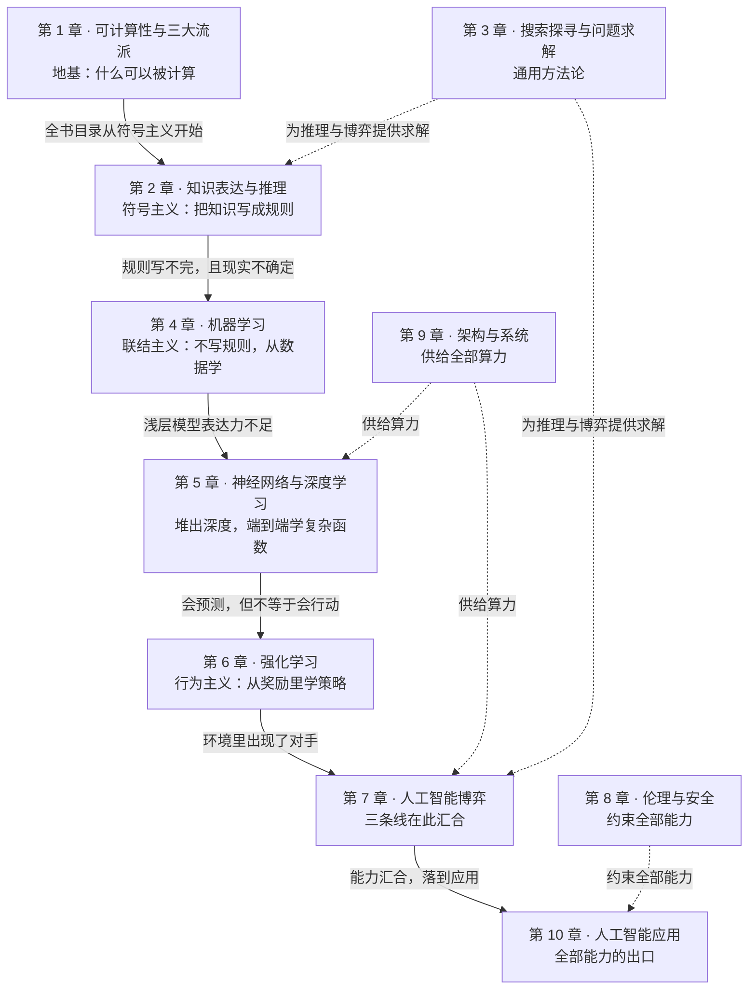
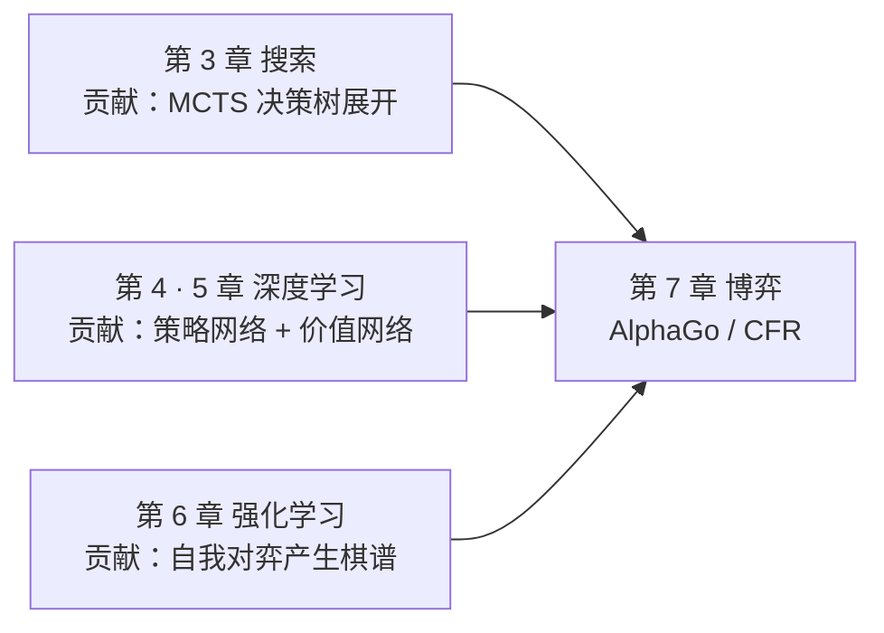

# 《人工智能引论》十章整体框架

> 依据：全部 10 份课件（共 **602 页**）通读梳理
> 授课：高俊龙｜教材：吴飞、潘云鹤《人工智能引论》高教社 2024（101 计划核心教材）
> 整理：2026-09-15

---

## 0. 结论先行

**第一章给出的"人工智能三大主流方法"，不是知识点，是目录。**

第一章 P31 讲符号主义 / 联结主义 / 行为主义——后面 9 章就是按这三条线分配的。看懂了这张分类表，整门课的结构就摊开了。

---

## 1. 全书骨架：三条主线 + 两条横切 + 一个汇合

| 层 | 承担 | 章节 | 这一层要回答的问题 |
|---|---|---|---|
| **地基** | 可计算性 | 第 1 章 | AI 凭什么**可能**？ |
| **符号主义** | 规则 | 第 2 章 | 知识怎么**表示**？ |
| **通用方法论** | 搜索 | 第 3、7 章 | 怎么在**状态空间**里找到解？ |
| **联结主义** | 数据 | 第 4、5 章 | 怎么从数据里**学出**一个函数？ |
| **行为主义** | 交互 | 第 6 章 | 怎么在**试错**中找到最优策略？ |
| **横切** | 约束 | 第 8 章 | 出了事**谁负责**？ |
| **横切** | 算力 | 第 9 章 | 模型**跑在哪**？ |
| **汇合** | 落地 | 第 10 章 | 到底**用在哪**？ |

> ⚠️ **归属上的一个精确说明**（第三轮读第三章时发现的修正）：
>
> 第 3 章课件 P3 明确写着——"搜索探寻与问题求解这一类方法是人工智能中实现的**具体方法和过程**，而符号主义、联结主义、行为主义是人工智能的**不同学派**，可以将搜索探寻与问题求解**用于**符号主义、联结主义、行为主义的方法中。"
>
> 所以**搜索（第 3 章）是通用方法论，不属于任何一个流派**。第 2 章的过渡页写着"符号主义的基础内容"，第 3 章没有这样的定位——这不是疏漏，是刻意的区分。第 7 章博弈同理（它同时用到搜索、强化学习和深度网络）。

> **页数分布本身就是考试重心的信号**：
>
> | 板块 | 章节 | 页数 | 占比 |
> |---|---|---|---|
> | 联结主义 + 行为主义 | 4、5、6 | **231** | **38%** |
> | 通用方法论（搜索/博弈） | 3、7 | 111 | 18% |
> | 横切 | 8、9 | 77 | 13% |
> | 符号主义（知识表示） | 2 | 72 | 12% |
> | 地基 | 1 | 67 | 11% |
> | 汇合 | 10 | 44 | 7% |
>
> 第 4、5、6 三章合计占 38%——**这门课的重心在"学习"（数据驱动），不在"推理"（规则驱动）**。

---

## 2. 逻辑关系图：十章之间的因果链

> 上一节的分类表告诉你"这章属于哪个流派"，但它解释不了**为什么会有这一章**。
> 这一节换一个组织方式：按"每一章在补上一章留下的什么缺口"来排。**箭头上的字才是重点。**

> ⚠️ **读这一节前先看第 7 节。** 下面这条链描述的是**知识本身该有的继承关系**，不是课程实际建立起来的联系。
> 逐章做概念复用统计后发现：十章之间只有三组概念真正跨章复用，四章是内容孤岛。
> **这条链是"应该的骨架"，第 7 节是"实际的组织度"。** 两者要分开用。

### 2.1 主线：一条"瓶颈驱动"的演化链

**读法**：蓝色主干上的每一章，都是因为上一章**撞到了墙**才出现的。灰色三章不在这条链上，它们横向服务于全链。

### 2.2 每条边到底在说什么

| 边 | 上一章留下什么缺口 | 下一章怎么补 |
|---|---|---|
| **1 → 2** | 证明了"能被计算"，但没说该算什么 | 走第一条线：把知识写成符号规则，用逻辑推理 |
| **2 → 4** | 规则要人**手工写**，写不完；而且现实本身是不确定的 | 不写规则，**从数据里学**（第 2 章内部的概率图 → 因果，就是这次转向的伏笔） |
| **4 → 5** | 线性回归、决策树这类浅层模型逼近能力有限 | 堆深度，端到端逼近任意复杂函数 |
| **5 → 6** | 监督学习**要标签**，而且只会"预测"不会"行动" | 用奖励代替标签，直接学"该怎么做" |
| **6 → 7** | 假设环境里**只有一个决策者** | 引入对手，变成多智能体对抗 |
| **7 → 10** | 三条线合流后需要出口 | 全部能力的落地应用 |
| **3 → 链** | 状态空间会爆炸，穷举不可行 | 提供通用求解框架：BFS/DFS → A\* → α-β 剪枝 → MCTS |
| **8 → 链** | 能力越强，滥用与失效的代价越大 | 伦理、对抗攻击、隐私保护的约束层 |
| **9 → 链** | 算法想跑起来需要算力 | 芯片、内存墙、分布式训练 |

### 2.3 汇合点：第 7 章为什么是落点

第 7 章是全课程唯一**同时需要三种能力**的地方，所以它是三条线的交点：

- **搜索**给出"怎么在巨大的可能性空间里选下一步"——MCTS 负责展开决策树
- **深度学习**给出"先验直觉"——策略网络缩小搜索宽度，价值网络截断搜索深度
- **强化学习**给出"数据从哪来"——不靠人类棋谱，靠自我对弈无限生成

这三者**缺任何一个都不成立**：没有搜索就只有直觉，没有网络搜索宽度爆炸，没有自我对弈就没有训练数据。

第 1 章 P40 那句"三种学习方法的综合利用值得关注"，落点就在这里。

### 2.4 一句话串起全课

> **能算**（1）→ 但要**描述世界**（2）→ 而世界是**不确定的**（2 内部）→ 于是**改从数据学**（4）→ 学得**不够深**（5）→ 会算不会**做**（6）→ 做的**时候还有对手**（7）→ 全部能力都要**约束**（8）和**算力**（9）→ 最后落成**应用**（10）。

搜索（3）不在这句话里，因为它是一种**手段**而非一个**阶段**——任何一步都可以用搜索来实现。

---

## 3. 四条贯穿全书的线索

### 线索一：三大流派的展开（最粗的那条）

| 流派 | 怎么教 | 对应章节 | 关键概念链 |
|---|---|---|---|
| 符号主义 | 用规则教 | 2 | 命题逻辑 → 谓词逻辑 → 知识图谱 |
| （搜索，通用方法论） | —— | 3、7 | 状态空间 → A* → Minimax/α-β剪枝 → MCTS → CFR |
| 联结主义 | 用数据学 | 4 → 5 | 回归/决策树 → 神经网络 → CNN/RNN → 注意力 |
| 行为主义 | 用问题引导 | 6 | MDP → 价值函数 → Q 学习 → 策略梯度 |

**第 7 章是三条线的交汇点**：AlphaGo = 通用搜索（MCTS）+ 行为主义的强化学习（自我对弈）+ 联结主义的表征（深度网络）。第一章 P40 那句"三种学习方法的综合利用值得关注"，落点就在这里。

### 线索二：AI 的四个动作——表示 → 学习 → 搜索 → 决策

| 动作 | 章节 | 具体内容 |
|---|---|---|
| **表示** | 2、4、5 | 命题/谓词逻辑、知识图谱、数据向量化、特征表示 |
| **学习** | 4、5、6 | 从数据拟合、参数优化、从奖励学策略 |
| **搜索** | 3、7 | A*、Minimax、MCTS、CFR |
| **决策** | 6、7 | 策略、纳什均衡、行动选择 |

### 线索三：确定性 → 不确定性

第 2 章内部是这条线最完整的演示：命题逻辑（全确定）→ 谓词逻辑 → 知识图谱 → **概率图（承认不确定）** → **因果（相关≠因果）**。

到了第 8 章，不确定性变成"敌人"：对抗样本、数据投毒、后门攻击——都是在对"模型输出的确定性"下手。

### 线索四：从算法到系统

第 9 章把前面所有算法"落地"：**内存墙**（冯·诺依曼架构的瓶颈）、GPU/TPU、CUDA、数据并行、All-Reduce、流水线并行。

> 这一章对你的嵌入式方向价值最高，别的课不会讲。

---

## 4. 逐章骨架

> 格式：**定位** → 节结构 → 实验/作业落点

### 第 1 章 可计算理论与图灵机（67 页）

**定位**：全书的目录页。章名有误导性——真正讲可计算理论的只有 4 页，其余是 AI 概述 + 发展史 + 三大流派。

- **一、技术梦想与科幻故事**：automaton / robot 词源、木牛流马与偃师造人、荀子"感知→理解→认知→决策行动"
- **二、可计算理论与图灵机**：希尔伯特 23 问（完备性/一致性/可判定性）→ 哥德尔不完备定理 → 图灵机 → 图灵测试
- **三、人工智能算法主流模型**：AI 诞生（达特茅斯）→ 两落三起 → **三大流派**（符号/联结/行为）→ AlphaGo → AlphaFold
- **四、课程内容概要**：十章地图
- **五、趋势与发展**：五大智能技术新方向、超大规模化（GPT-3）、端云协同、因果推理
- **六、实训题目安排**：4 题 × 5 分 + 前沿调研 20 分

**必考**：三大流派、两落三起、三次低谷原因（算力不足 + 承诺过度）。

### 第 2 章 知识表达与推理（72 页）★ 最硬

**定位**：符号主义的理论内核。**五节是"确定性逐步松动"的一条链，不是并列知识点。**

- **一、命题逻辑**：命题定义、五种联结词、真值表、蕴含、等价式、假言推理、**归结法**
- **二、谓词逻辑**：个体/谓词/量词、∀ 与 ∃、量词否定、自然语言→谓词、苏格拉底三段论、飞机题
- **三、知识图谱推理**：三元组、六度分隔、归纳与演绎、**FOIL 算法**（信息增益、序贯覆盖）、**PRA 路径排序**
- **四、概率图推理**：贝叶斯网络（有向无环、局部马尔可夫性）、马尔可夫网络（无向）、**马尔可夫逻辑网络 MLN**
- **五、因果推理**：辛普森悖论、因果/混淆/选择三种关联、结构因果模型、**do 算子**、反事实、**因果之梯**

**详细补全版见** → [[9.15 第一二章补课串讲]]

### 第 3 章 搜索探寻与问题求解（59 页）

**定位**：符号主义的另一条腿——**把"思考"变成"在搜索树上找路径"**。

- **一、搜索基本概念**：搜索的形式化描述（状态/动作/代价）、搜索树构建、评测标准、搜索框架
- **二、贪婪最佳优先搜索与 A\* 搜索**：启发函数、评价函数、贪婪为何失败、A\* 的**可容性 / 一致性 / 完备性 / 最优性**
- **三、Minimax 搜索与 alpha-beta 剪枝**：对抗搜索定义、搜索策略、剪枝示意
- **四、蒙特卡洛树搜索**：四要素、策略计算、**上限置信区间 UCB**、霍夫丁不等式

**实验**：黑白棋（Mini AlphaGo）
**题记**：故记诵者，学问之舟车也。——清·章学诚《文史通义》

### 第 4 章 机器学习（77 页）

**定位**：联结主义的地基。**"学习"到底是什么——在假设空间里找最优函数。**

- **一、机器学习基本概念**：概念与分类、常见任务、数据如何表达成数字、训练/验证/测试集、**没有免费的午餐**、损失函数、**经验风险 vs 期望风险**、泛化能力、模型度量、**频率学派 vs 贝叶斯学派**
- **二、监督学习：回归分析与决策树**：一元/多元/非线性回归、参数求解、决策树构建、**熵**
- **三、无监督学习：K 均值聚类**
- **四、特征降维**：**LDA**（线性判别分析，拉格朗日乘子法）、**PCA**（主成分分析，特征值分解、**SVD**）、**特征人脸**
- **五、演化学习**：演化算法

**作业**：提交事项页写"截止 2025 年 10 月 31 日 24:00"（⚠️ 见第 5 节）

**题记**：化繁为简、大巧不工

### 第 5 章 神经网络与深度学习（78 页）★ 页数最多

**定位**：联结主义的现代形态。

- **一、前馈神经网络与参数优化**：神经元、**感知机（冰火两重天）**、激活函数、损失函数、梯度下降（BGD/SGD）、**误差反向传播**、参数更新算例、MSE 能否用于分类
- **二、卷积神经网络**：为什么需要卷积、卷积过程与意义、卷积算子、**padding / striding**、**池化**、CNN 全貌
- **三、循环神经网络**：RNN、自然语言处理例子、**应用模式**、梯度传递、**LSTM**
- **四、注意力与正则化**：朴素注意力、**自注意力**、**Layer Normalization**、**多头注意力**、正则化
- **五、深度学习在 NLP 和 CV 中的应用**
- **六、实验**：手写数字识别

**题记**：Neurons that fire together, wire together. —— Donald Hebb

### 第 6 章 强化学习（76 页）

**定位**：行为主义。**没有标签，只有奖励——怎么学？**

- **一、强化学习问题定义**：术语（智能体/环境/状态/动作/策略/奖励）、与监督/无监督的对比、**马尔可夫链 → 引入奖励 → 引入回报 → MDP**、轨迹、价值函数、动作-价值函数、**贝尔曼方程**
- **二、基于价值的强化学习**：**策略优化定理**、策略评估三法（**动态规划 / 蒙特卡洛 / 时序差分**）、价值迭代的问题、**Q 学习**、**探索与利用**、参数化与深度强化学习、**DQN**
- **三、基于策略的强化学习**：**策略梯度法**、策略梯度定理、基于 MC 的策略梯度、**Actor-Critic**
- **四、深度强化学习应用**：围棋、**实验 DQN CartPole**、面临的挑战

**题记**：谋定而后动，知止而有得

### 第 7 章 人工智能博弈（52 页）

**定位**：三条线的交汇。**当决策者不止一个，而且互相拆台。**

- **一、博弈论相关概念**：中国古代博弈思想、现代博弈论诞生、**囚徒困境**、博弈分类、**纳什均衡**、混合策略下的纳什均衡、**策梅洛定理**
- **二、博弈策略求解**：**虚拟遗憾最小化算法（CFR）**、有效遗憾值、石头剪刀布例子、**库恩扑克**例子、**安全子博弈**
- **三、博弈规则设计**：双边匹配问题、单边匹配算法
- **四、非完全信息博弈**

**题记**：两害相权取其轻，两利相权取其重

### 第 8 章 人工智能伦理与安全（40 页）

**定位**：横切约束。**技术能做什么 ≠ 应该做什么。**

- **一、人工智能伦理**：伦理概念起源、**科技的双重属性**、**科林格里奇困境**、大模型伦理道德事件、**大模型备案**、辛顿对 AI 伦理的担忧、机器是否有自我意识
- **二、人工智能模型安全**：**对抗攻击**（对抗样本生成：L-BFGS / **FGSM** / **PGD**、**白盒 → 黑盒**、**数据投毒**、**后门攻击**）、防御（抵抗对抗攻击 / 投毒 / 后门）、**隐私保护与差分隐私**
- **三、人工智能可解释性**：可解释性深度学习、越复杂的模型可解释性越差

**题记**：未雨绸缪、成己成物

### 第 9 章 人工智能架构与系统（37 页）★ 对嵌入式方向最相关

**定位**：横切算力。**算法之外的两条腿——芯片和系统。**

- **一、人工智能基础软硬件框架**：智能计算支撑框架、英伟达的算力地位
- **二、人工智能芯片**：**GPU**、**CUDA 编程**、**TPU**、**冯·诺依曼架构与"内存墙"**、**端侧芯片**
- **三、人工智能系统**：编程框架、**分布式神经网络训练**（数据并行、**All-Reduce**、流水线并行、张量并行的 vLLM）、系统关键要素、异构硬件通信优化、大规模部署、"鹏城云脑"

**题记**：君子性非异也、善假于物

### 第 10 章 人工智能应用（44 页）

**定位**：汇合落地。

- **一、语言基础模型（大语言模型）**：NLP 范式变革、语言大模型建模、**编码 / 解码 / 编码-解码模型**、**预训练**、**SFT**、指令微调数据集构造、**RLHF**、人在环路反馈、InstructGPT
- **二、自然语言中的机器翻译**：基于文法 → 基于统计（SMT）→ 基于深度学习
- **三、图像分类与视觉对象定位**
- **四、语音识别与合成**：基于 HMM → 基于神经网络、语音合成
- **五、科学计算**：**物理约束下的神经网络**
- **六、跨媒体计算**
- **七、机器人控制**

**题记**：凡贵通者，贵其能用之也

---

## 5. 课件层面的三个观察

### ① 这份课件是 2025 年的，今年沿用

- 第一章封面页写着"高俊龙 **2025 年**"
- 第四章 P74 提交事项写着"截止时间：**2025 年 10 月 31 日** 24:00"

> ⚠️ **所以课件里所有日期都不能直接信**。今年的作业截止时间要去课堂/课程群确认，别照抄。

### ② 每章都有一句"题记"

这是高老师的固定风格，八章题记全部是古语或名言：

| 章 | 题记 |
|---|---|
| 3 | 故记诵者，学问之舟车也。——清·章学诚《文史通义》 |
| 4 | 化繁为简、大巧不工 |
| 5 | Neurons that fire together, wire together. —— Donald Hebb |
| 6 | 谋定而后动，知止而有得 |
| 7 | 两害相权取其轻，两利相权取其重 |
| 8 | 未雨绸缪、成己成物 |
| 9 | 君子性非异也、善假于物 |
| 10 | 凡贵通者，贵其能用之也 |

> **用处**：如果考试出"谈谈你对某章的理解"这类开放题，题记就是最好的切入角度。

### ③ 每章结尾都有"延伸阅读"，部分章有"实验页"

| 章 | 实验 / 作业落点 |
|---|---|
| 3 | 实验：黑白棋（Mini AlphaGo） |
| 4 | 提交事项（有截止时间页） |
| 5 | 实验：手写数字识别 |
| 6 | 实验：深度 Q 网络 DQN —— CartPole 游戏 |
| 8 | 大模型伦理道德事件、大模型备案（偏案例讨论） |

---

## 6. 学习路线建议

**按"是否直接服务实训/考试"排序投入**：

1. **第 3、4、5、6 章**（★★★）——各对应一个实训小题，四章合计 290 页（**48%**）。这是投入产出比最高的四章。
2. **第 9 章**（★★☆）——对嵌入式方向的长期价值最高（AI 芯片、内存墙、量化、算子调度），虽然只有 37 页。
3. **第 2 章**（★★☆）——考试最硬，但和《离散数学》命题逻辑章节重叠，一份精力两份收益，跟课走就能拿下。
4. **第 1、7 章**（★★☆）——第 1 章概念密要背；第 7 章 CFR 算法细节多，考试若考多半在纳什均衡。
5. **第 8、10 章**（★☆☆）——通识性内容，当综述听，考前过一遍即可。

**一句话策略**：**跟着实训走**。四个实训题分别落在第 3、4、5、6 章——把它们当真的做一遍，这四章自然就通了，同时拿到 20 分。

---

## 7. 内容逻辑：章内是递进链，章间是并列模块

**问题**：这门课的内容有逻辑吗？章与章之间有关系吗？

**答案分三层，强度递减：**

| 层次 | 逻辑强度 | 说明 |
|---|---|---|
| **章内** | **强** | 每章的小节是一条"缺口驱动"的演绎链，单章自洽 |
| **章间** | **弱** | 三条并列技术路线，靠少数共用概念缝合 |
| **全课** | **中** | 有一条隐含主线（表示 → 学习 → 搜索 → 决策），但它是学完才看得出来的 |

### 7.1 章内：所有章共用同一条推理模式

**"先给一个能力 → 指出它不够用 → 补一个机制 → 再指出还不够"**

所以每章的小节**不是并列清单，是缺口驱动的递进**。三条实例：

| 第 2 章 知识表达 | 缺口 |
|---|---|
| 命题逻辑 → | 表达不了个体与关系 |
| 谓词逻辑（∀∃）→ | 推理封闭、确定性 |
| 知识图谱推理 → | 承载不了不确定性 |
| 概率图推理 → | 只会"看"，不会"干预" |
| 因果推理（do 算子） | — |

| 第 5 章 神经网络 | 缺口 |
|---|---|
| 感知机 / MCP 神经元 → | 单层连异或都解不了 |
| 前馈网络 + 反向传播 → | 全连接参数爆炸 |
| 卷积网络 CNN → | 处理不了变长序列 |
| 循环网络 RNN → | 长程依赖消失、无法并行 |
| 注意力 Transformer | — |

| 第 6 章 强化学习 | 缺口 |
|---|---|
| 马尔可夫链 → | 会变，但不知求什么 |
| ＋奖励 → 回报 → | 只有评价，不能决策 |
| ＋动作 → MDP → | 环境模型未知 |
| DP / MC / TD / Q 学习 → | 状态太大、动作连续 |
| 策略梯度 / DQN | — |

**第 6 章是最干净的样本**：每步只加一个元素（＋奖励、＋动作），是全书教学设计最好的一章。

### 7.2 章间：三条并列路线，不是上下游依赖

| 路线 | 知识来源 | 章节 |
|---|---|---|
| 符号主义 | 人写规则 | 第 2 章 |
| 联结主义 | 数据里学 | 第 4、5 章 |
| 行为主义 | 交互试错 | 第 6 章 |
| 通用手段 | —（可服务任一流派） | 第 3 章 |
| 合流 | 三者都要 | 第 7 章 |

**这三条线在内容上是"替代方案"，不是"前后依赖"**——第 2 章与第 4 章甚至是哲学对立（规则 vs 数据）。
**不懂第 5 章也能学第 6 章**，这跟"操作系统"那种课（不懂进程就学不了内存管理）完全不同。

### 7.3 逐章概念复用统计（判断"有关系"的硬证据）

把十二组核心概念在十章的词频统计出来，看哪些概念跨章出现：

| 概念 | 出现的章 |
|---|---|
| 逻辑与推理规则 | **只有第 2 章** |
| 概率与贝叶斯公式 | 第 2、4 章 |
| 损失函数与参数优化 | 第 4、5、6 章（8、9、10 回指） |
| 神经网络与反向传播 | 第 5、9 章（1、6、7、8、10 提及） |
| 采样与蒙特卡洛 | 第 3、6 章（7 提及） |
| 搜索与状态空间 | **几乎只有第 3 章** |
| 价值函数与序贯决策 | 第 6 章（7 提及） |
| 对抗与均衡 | 第 7、8 章（3 提及） |
| 卷积与注意力 | 第 5 章（10 提及） |
| 算力与并行 | **几乎只有第 9 章** |
| 安全与可解释 | **只有第 8 章** |

**真正跨章复用的只有三组**：

1. **概率 → 第 2 ↔ 第 4 章**
2. **采样 / 蒙特卡洛 → 第 3 ↔ 第 6 ↔ 第 7 章**（MCTS 的随机模拟 → 强化学习的 MC 策略评估 → 博弈的 CFR）
3. **参数优化与神经网络 → 第 4 → 5 → 6 章**，并被第 8、9、10 章反复回指

**内容孤岛**：第 1 章（可计算性）、第 2 章（逻辑部分）、第 3 章（搜索）、第 8 章（安全）、第 9 章（算力）。

> ⚠️ **最需要注意的一条**：**第 2 章的五个小节里，只有第四节（概率图推理）接得上后续章节。**
> 命题逻辑、谓词逻辑（也是它最难的部分）、知识图谱推理、因果推理，在后面九章**零复用**。
> **最难的部分，是唯一没有后续的部分**——这就是第 2 章听起来最孤立、最像"另一门课"的原因。

### 7.4 讲课顺序 vs 逻辑顺序

| | 顺序 | 用途 |
|---|---|---|
| **讲课顺序** | 1 → 2 → 3 → 4 → 5 → 6 → 7 → 8 → 9 → 10（线性，不跳章） | 跟着课表走 |
| **逻辑顺序** | 三条并列路线 + 三组概念复用 | 理解内容关系 |

**难度上也不是递进安排的**：第 1 章易 → 第 2 章最难 → 第 3、4 章中 → 第 5、6 章难 → 第 7 章中 → 第 8–10 章易。**没有由易到难的梯度**，它是按知识版图切块，不是按教学梯度排的。

### 7.5 实用结论

1. **任何一章听不懂，退回该章的上一节就能救**——因为章内是递进链，承接关系明确。
2. **但指望"下一章会讲明白"是等不到的**——章间没有这种安排。
3. **把每章当独立专题攻克**，不要等前后呼应；同时在脑子里维护一份"接口清单"（第 7.3 节那三组），知道哪些概念会跨章复用。

---

## 附：相关笔记

| 内容 | 位置 |
|---|---|
| 十章课件（pptx，602 页） | `~/Documents/学科资料/PPT/《人工智能引论》-第一至十章/` |
| 9.8 第一次课引入 | [[9.8引入]] |
| 第一、二章补课串讲（详细版） | [[9.15 第一二章补课串讲]] |
| 第三章精读（含 MCTS 细节与实训要求） | [[第三章 搜索探寻与问题求解]] |
| 课程情报 · 考核 · 难度价值判断 | [[课程总览与学习路线]] |
