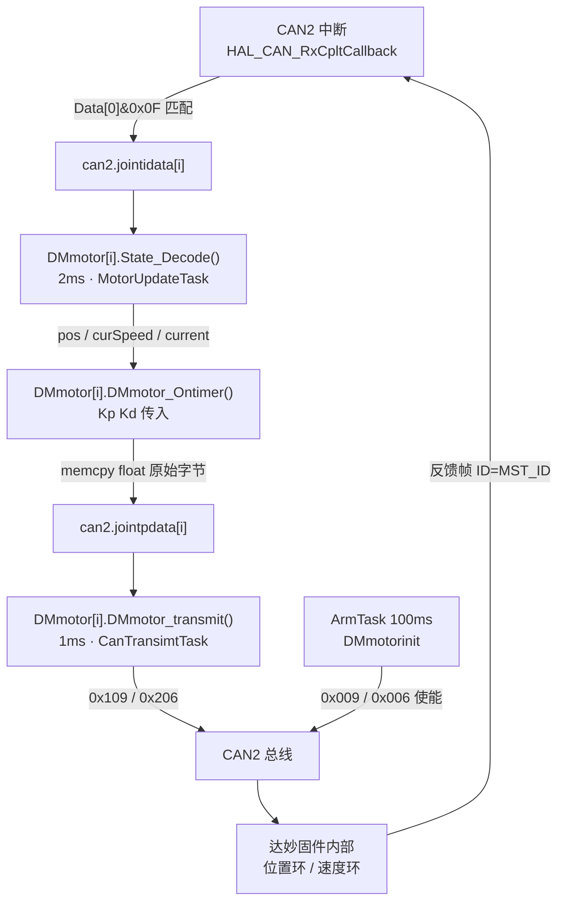

# 达妙（DM）电机数据传递链条

> 代码基准：`Sentinel_robot/STM32F405`，2026-09-25 落盘状态
> 涉及文件：`can.h/cpp`、`HTmotor.h/cpp`、`taskslist.cpp`、`STM32F405.cpp`

---

## 0. 一句话总览

**达妙这条链上没有任何 PID。** 闭环跑在电机自己的固件里，STM32 只负责
「收反馈 → 翻译成物理量 → 按协议打包设定值 → 发出去」。这和 M3508/M6020 那条链
（PID 在 `Motor::Ontimer` 里）是**结构性不同**的两套东西，不要用同一套心智模型去理解。

```
CAN 中断  ──►  jointidata[i]  ──►  State_Decode  ──►  pos / curSpeed / current
                                        (解码，无控制)
                                                              │
                                                              ▼
                                            DMmotor_Ontimer  ──►  jointpdata[i]
                                            (打包设定值，无控制)
                                                              │
                                                              ▼
                                          DMmotor_transmit  ──►  CAN 总线
                                            0x109 / 0x206
```

---

## 1. 硬件与协议层

### 1.1 装配表（以 `STM32F405.cpp` 为准）

```cpp
DMMOTOR DMmotor[2] = {
	DMMOTOR(0x09, P_S,   Pitch),   // 槽 0
	DMMOTOR(0x06, SPEED, Yaw),     // 槽 1
};
```

| 对象 | 轴 | `ID`(CAN_ID) | 模式 | 挂载总线 |
|---|---|---|---|---|
| `DMmotor[0]` | Pitch | `0x09` | `P_S`（位置速度） | can2 |
| `DMmotor[1]` | Yaw | `0x06` | `SPEED`（速度） | can2 |

### 1.2 仲裁 ID 规则（决定"发给谁、谁发来的"）

| 用途 | 仲裁 ID | 本机实际值 |
|---|---|---|
| 使能 / 失能 / 置零 / 清错 | `CAN_ID` | `0x009` / `0x006` |
| MIT 控制帧 | `CAN_ID` | 未使用 |
| POS_VEL 控制帧 | `0x100 + CAN_ID` | **`0x109`**（Pitch） |
| VEL 控制帧 | `0x200 + CAN_ID` | **`0x206`**（Yaw） |
| **反馈帧** | **`MST_ID`（默认 0）** | `0`（两台相同） |

⚠️ **关键点：两台电机的反馈帧仲裁 ID 是同一个值（默认 MST_ID = 0）。**
所以**不能靠仲裁 ID 区分是哪台电机**，只能靠数据段自带的身份字节。这是整条链最容易踩的坑。

### 1.3 帧格式：反馈恒定位域，控制帧随模式变

**反馈帧（8 字节，格式与工作模式无关，永远是 MIT 位域）**

| 字节 | 内容 |
|---|---|
| `D[0]` | `CAN_ID \| (ERR << 4)` —— 低 4 位是身份，高 4 位是故障码 |
| `D[1] D[2]` | 位置（16 位定点） |
| `D[3]` + `D[4]` 高 4 位 | 速度（12 位定点） |
| `D[4]` 低 4 位 + `D[5]` | 力矩 / 电流（12 位定点） |
| `D[6] D[7]` | MOS 温度 / 转子温度（代码未解码） |

**控制帧（格式随 `function` 变）**

| 模式 | 仲裁 ID | 数据段 8 字节 | Kp/Kd |
|---|---|---|---|
| `MIT` | `CAN_ID` | p(16) v(12) kp(12) kd(12) t(12) | **在帧里** |
| `P_S` | `0x100 + CAN_ID` | float 位置 + float 速度 | 不在帧里 |
| `SPEED` | `0x200 + CAN_ID` | float 速度 + 4 字节 0 | 不在帧里 |

### 1.4 位打包 vs 原始字节（两种模式的本质区别）

| | MIT | P_S / SPEED |
|---|---|---|
| 物理量怎么进数据段 | `float_to_uint()` 量化成定点整数，接收端反算 | **IEEE 754 float 的原始内存字节，直接 memcpy** |
| 要不要转换 | 要，按 `[MIN, MAX]` 线性映射 | **不要** |
| 字节序 | 大端手排（`p >> 8` / `p & 0xFF`） | 小端（Cortex-M 原生） |

> 学姐/学长当时在这里蒙住，就是想给 P_S 也用 `float_to_uint`。
> **不是"有问题待解决"，是压根不该用** —— P_S 协议里位置就是 float 本身。

---

## 2. 三段链路（按任务周期分层）

### 2.1 使能链 —— `ArmTask`，100 ms

```
ArmTask
 └─ DMmotor[i].DMmotorinit(can2)
      └─ CanComm_ControlCmd(hcan, CMD_MOTOR_MODE)
           ├─ 建 8 字节模板 { FF FF FF FF FF FF FF 00 }
           ├─ buf[7] = 0xFC          ← 进入电机（使能）
           └─ hcan.Transmit(this->ID, buf, 8)   →  仲裁 ID 0x009 / 0x006
```

**为什么必须每 100 ms 重发？**
达妙有**通信丢失保护**：CAN 命令超时后电机自动退出使能。所以这不是冗余，是刚需。

### 2.2 接收链 —— CAN2 中断

```
CAN2_RX0_IRQHandler
 └─ HAL_CAN_IRQHandler(&can2.hcan)
      └─ HAL_CAN_RxCpltCallback(hcan)          // can.cpp
           ├─ id = hcan->pRxMsg->StdId
           ├─ if (0x201 ≤ id ≤ 0x208)          // M3508/M6020/M2006 反馈段
           │     └─ memcpy(canX.data[id - 0x201], Data, 8)
           └─ else                             // 达妙段（仲裁 ID = MST_ID）
                 └─ for i in [0, sizeof(DMmotor))
                      if ((Data[0] & 0x0F) == (DMmotor[i].ID & 0x0F))
                           memcpy(can2.jointidata[i], Data, 8);  break;
           └─ __HAL_CAN_ENABLE_IT(hcan, CAN_IT_FMP0)   // 重新开中断
```

三点必须记住：

1. **分流靠区间**（`0x201~0x208`），不靠等于某个数 —— 达妙的反馈 ID 是 0，天然落进 else。
2. **认电机靠 `Data[0] & 0x0F`** —— 高 4 位是故障码（`ERR << 4`），一过流 `D[0]` 从 `0x09` 变 `0xA9`，`& 0x0F` 保证故障时身份照样认得出。
3. **槽号 = 循环下标 `i` = 在 `DMmotor` 里排第几**（这是"按位置"口径，见第 4 节）。

### 2.3 解码链 —— `MotorUpdateTask`，2 ms

```
for (i = 0; i < N; i++)
    DMmotor[i].State_Decode(can2.jointidata)                     // 解码
        .DMmotor_Ontimer(Kp, Kd, can2.jointpdata[i]);            // 打包
```

`State_Decode(uint8_t idata[][8])` 内部：

```
① this 反查槽号
   uint8_t id = 0xFF;
   for (i...) if (&DMmotor[i] == this) { id = i; break; }
   if (id == 0xFF) return *this;        // 不在册，不做任何事

② 位置：pos = uint_to_float( (idata[id][1] << 8) | idata[id][2], P_MIN, P_MAX, 16 )
③ 速度：curSpeed = uint_to_float( (idata[id][3] << 4) | (idata[id][4] >> 4), V_MIN, V_MAX, 12 )
④ 力矩：current = uint_to_float( idata[id][5] | ((idata[id][4] & 0x0F) << 8), C_MIN, C_MAX, 12 )
        torque  = current * KT      // KT = 1.4 N·m/A
```

> **注意 ①②③ 的 `[1] [2] [3] [4] [5]`**：比原始 `Data[]` 偏移了一位，因为 `Data[0]` 是身份字节。

### 2.4 计算链 —— `DMmotor_Ontimer`（无 PID！）

```
① LIMIT_MIN_MAX 就地钳制 setPos / setSpeed / f_kp / f_kd / setTorque
   ⚠️ 改的是成员变量本身，不是局部副本 —— 上层的给定值会被永久改掉

② switch (this->function)
     case MIT:    16/12/12/12/12 位打包（当前无电机使用）
     case P_S:    memcpy(odata,     &setPos,   4);
                  memcpy(odata + 4, &setSpeed, 4);
     case SPEED:  memcpy(odata,     &setSpeed, 4);
                  memset(odata + 4, 0, 4);
     default:     memset(odata, 0, 8);      // 宁可发零帧，也别发上一次的残留
```

**`odata` 就是 `can2.jointpdata[i]`。** 这个函数只写缓冲区，不碰总线。

### 2.5 发送链 —— `CanTransimtTask`，1 ms，三态轮转

```
switch ((timer.counter++) % 3)
  case 0:  DMmotor[0].DMmotor_transmit(can2);      // 0x109  Pitch (P_S)
           DMmotor[1].DMmotor_transmit(can2);      // 0x206  Yaw   (SPEED)
  case 1:  can1.Transmit(0x1ff, can1.temp_data + 8);
           can2.Transmit(0x1ff, can2.temp_data + 8);
  case 2:  can1.Transmit(0x200, can1.temp_data);
           can2.Transmit(0x200, can2.temp_data);
```

`DMmotor_transmit(CAN& hcan)` 内部：

```
① this 反查 slot（同 State_Decode 的写法）
② switch (function) 决定协议偏移
     MIT → 0x000 ;  P_S → 0x100 ;  SPEED → 0x200
③ hcan.Transmit(ID + offset, hcan.jointpdata[slot], 8)
```

**所以每个 3 ms 一轮**：控制帧 + 0x1ff 帧 + 0x200 帧 各一次。

---

## 3. 完整调用链（代码级）



---

## 4. 槽位口径（唯一约定）

`can.h` 里两个独立数组：

```cpp
uint8_t jointpdata[6][8]{};   // 发：要发给电机的指令
uint8_t jointidata[6][8];     // 收：电机反馈的原始字节
```

**每行 = 一台电机的一个槽。同一台电机在两者中必须是同一个号。**

| 支路 | 谁写 / 谁读 | 槽号来源 | 口径 |
|---|---|---|---|
| 收 | `can.cpp` 回调 | `for` 循环下标 `i` | **按数组位置** |
| 发 | `DMmotor_transmit` | `this` 反查下标 `slot` | **按数组位置** |

两条路同口径，所以"读自己反馈"和"发自己指令"永远落在同一格。

> **反例警示**：若有人把回调改成 `jointidata[DMmotor[i].ID & 0x0F]`（按 ID 索引），
> 发支路必须同步改，而且 `ID = 0x09` 会直接越界（数组只有 6 行）。
> 槽号（软件位置）和 CAN_ID（硬件编号）之间**没有换算关系**，别用公式互推。

---

## 5. 达妙 vs 大疆：PID 在哪

| | M3508 / M6020 / M2006 | 达妙 DM |
|---|---|---|
| 闭环位置 | **STM32 里**，`Motor::Ontimer` 的 SPD/POS/ACE 分支 | **电机固件里** |
| PID 参数在哪 | 构造时传入的 `PID` 对象 | **达妙上位机**（除 MIT 模式外） |
| STM32 发什么 | 电流 / 电压指令 | **位置/速度设定值**（P_S、SPEED） |
| 输出成员 | `Motor::current` → `temp_data` | `DMMOTOR::setPos/setSpeed` → `jointpdata` |

**推论：`DMMOTOR::Kp = 10.f` / `Kd = 0.6f` 在当前配置下是死参数。**
它们只在 MIT 分支被 `float_to_uint` 打包进帧，而两台达妙都不走 MIT —— 传了，一个字节都发不出去。

另两条达妙特性：

1. **上电默认 Disabled**，必须发使能帧。
2. **POS_VEL 里的 `v_des` 是"梯形加速的匀速段速度"（限速）**，不是"当前期望速度"。
   所以 P_S 模式给 `setSpeed = 0` 有可能被解释为"限速 0"而完全不动。

---

## 6. 待核对 / 风险点

| # | 位置 | 内容 | 性质 |
|---|---|---|---|
| ① | `HTmotor.cpp:35` | 力矩字段解码用 `C_MIN/C_MAX`(±40)，但编码侧（MIT 分支）用 `T_MIN/T_MAX`(±18) —— 同一段 12 位，两端量程不一致 | **待核手册** |
| ② | `HTmotor.cpp:57` | `default: return;` 时不写 `odata` → 发的是上一次残留 | 已用 `memset(odata,0,8)` 规避（default 分支） |
| ③ | `HTmotor.h:72` | 注释写"使能所有电机"，实际是"使能本电机" | 文档 |
| ④ | `HTmotor.h:19` | `MOTOR_MODE` 宏已无引用 | 可删 |
| ⑤ | `can.cpp:149` | 达妙反馈固定写 `can2.jointidata`，硬编码 can2 | 设计取舍 |
| ⑥ | `State_Decode` | `D[6] D[7]` 温度字段未解码 | 未实现 |
| ⑦ | `HTmotor.h:69/71/75` | `ZeroPosition` / `Motor_Start` / `Motor_Stop` 只有声明无定义 | 未实现 |

---

## 7. 调试验证判据

| 观察点 | 期望 |
|---|---|
| 编译 | 零错误、零 `undefined reference` |
| `can2.jointidata[0]` | 首字节低 4 位 = `9`；`[1]` 有变化（位置） |
| `can2.jointidata[1]` | 首字节低 4 位 = `6` |
| `can2.jointpdata[0]` 前 4 字节 | Pitch 的 `setPos` 的 IEEE 754 小端字节 |
| `can2.jointpdata[1]` 前 4 字节 | Yaw 的 `setSpeed` 的 IEEE 754 小端字节 |
| CAN 分析仪 | `0x109` 与 `0x206` 每 3 ms 各一次；`0x009` / `0x006` 每 100 ms |
| 单台隔离验证 | 固定 Pitch 反馈为常数，只有 `jointpdata[0]` 段变化 |

---

## 8. 经验规则（可复用）

> **凡是"关于本对象自身"的信息 —— CAN_ID、工作模式、在数组里的位置 —— 都从 `this` 取，
> 不作为参数传入。参数只传递"对象自己不知道的外部信息"（走哪条总线、执行什么命令）。**

> **两个缓冲区之间的槽号是唯一"语言"。字典只能有一本；要换口径，两条路必须一起换。**

> **"反馈帧格式固定、控制帧格式随模式变"** —— 解码器只需要写一份，编码器必须按模式分派。
